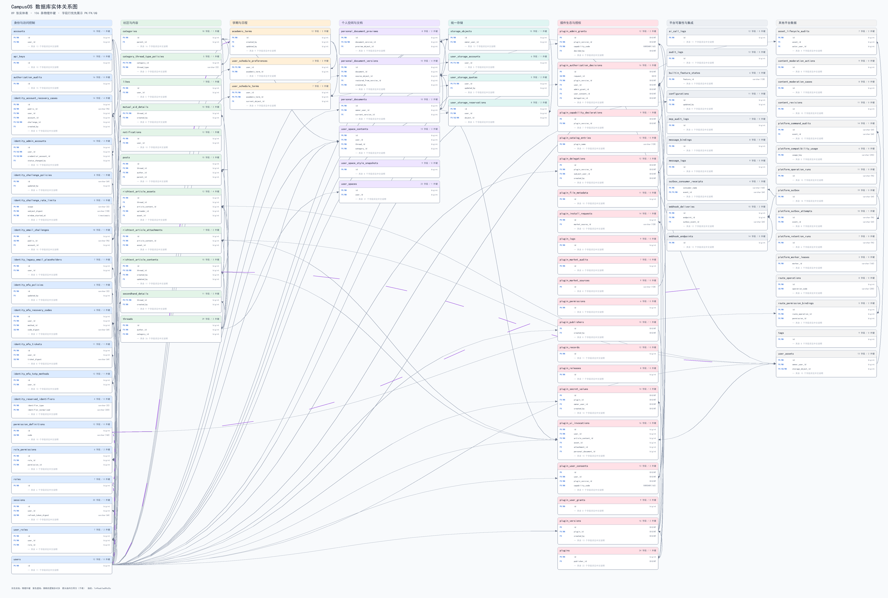

# CampusOS 数据库实体关系说明

<!-- campusos-er:schema_sha256=7c49aab7ae89e35c260ea5dad4118a7f72904bd772a129cec770c343d5b50d70;tables=89;foreign_keys=106 -->
> 本文档由 `migrations/tools/generate_er.py` 从 migration UP 文件自动生成，请勿手工维护生成区。



- 可缩放版本：[打开 SVG ER 图](./CampusOS数据库ER图.svg)
- 实体表：**89**
- 物理外键：**106**
- 一对一/可选一对一关系：**12**
- 一对多关系：**94**
- 推断的逻辑多对多关系：**5**
- Schema 指纹：`7c49aab7ae89e35c260ea5dad4118a7f72904bd772a129cec770c343d5b50d70`

## 1. 生成范围与判定规则

工具只读取 `*.up.sql`，不连接数据库，也不会执行 migration。当前输入文件：

- `000001_v1_1_schema_baseline.up.sql`
- `000002_v1_1_ui_only_plugin_runtime.up.sql`
- `000003_v1_1_trusted_market_sources.up.sql`

- **PK**：主键；**FK**：外键；**UQ**：全局唯一；**NN**：非空。
- 一对一仅在外键列集合同时构成主键或非部分唯一约束时判定。
- “子表可选”表示外键列允许为空；父记录对应的子记录数量仍可能为零。
- `ON DELETE`、`ON UPDATE` 来自 migration DDL；未显式声明时按 PostgreSQL `NO ACTION` 展示。
- 逻辑多对多是经关联实体推断的业务阅读视图，物理约束仍以两条外键为准。

## 2. 实体总览

| 业务域 | 实体表 | 字段数 | 主键 | 出站外键 | 入站外键 |
| --- | --- | ---: | --- | ---: | ---: |
| 身份与访问控制 | `accounts` | 15 | `id` | 1 | 3 |
| 身份与访问控制 | `api_keys` | 11 | `id` | 0 | 0 |
| 身份与访问控制 | `authorization_audits` | 16 | `id` | 0 | 0 |
| 身份与访问控制 | `identity_account_recovery_cases` | 14 | `id` | 4 | 0 |
| 身份与访问控制 | `identity_admin_accounts` | 14 | `id` | 3 | 0 |
| 身份与访问控制 | `identity_challenge_policies` | 8 | `id` | 1 | 0 |
| 身份与访问控制 | `identity_challenge_rate_limits` | 5 | `scope, subject_digest, window_started_at` | 0 | 0 |
| 身份与访问控制 | `identity_email_challenges` | 18 | `id` | 1 | 1 |
| 身份与访问控制 | `identity_legacy_email_placeholders` | 7 | `id` | 1 | 0 |
| 身份与访问控制 | `identity_mfa_policies` | 6 | `id` | 1 | 0 |
| 身份与访问控制 | `identity_mfa_recovery_codes` | 6 | `id` | 2 | 0 |
| 身份与访问控制 | `identity_mfa_tickets` | 11 | `id` | 1 | 0 |
| 身份与访问控制 | `identity_mfa_totp_methods` | 12 | `id` | 1 | 1 |
| 身份与访问控制 | `identity_reserved_identifiers` | 4 | `identifier_type, identifier_normalized` | 0 | 0 |
| 身份与访问控制 | `permission_definitions` | 12 | `id` | 0 | 2 |
| 身份与访问控制 | `role_permissions` | 6 | `id` | 2 | 0 |
| 身份与访问控制 | `roles` | 7 | `id` | 0 | 2 |
| 身份与访问控制 | `sessions` | 20 | `id` | 1 | 0 |
| 身份与访问控制 | `user_roles` | 7 | `id` | 2 | 0 |
| 身份与访问控制 | `users` | 12 | `id` | 0 | 48 |
| 社区与内容 | `categories` | 18 | `id` | 1 | 4 |
| 社区与内容 | `category_thread_type_policies` | 5 | `category_id, thread_type` | 1 | 0 |
| 社区与内容 | `likes` | 7 | `id` | 1 | 0 |
| 社区与内容 | `mutual_aid_details` | 10 | `thread_id` | 2 | 0 |
| 社区与内容 | `notifications` | 12 | `id` | 1 | 0 |
| 社区与内容 | `posts` | 15 | `id` | 3 | 1 |
| 社区与内容 | `richtext_article_assets` | 12 | `id` | 4 | 0 |
| 社区与内容 | `richtext_article_attachments` | 7 | `id` | 2 | 1 |
| 社区与内容 | `richtext_article_contents` | 15 | `id` | 3 | 3 |
| 社区与内容 | `secondhand_details` | 11 | `thread_id` | 2 | 0 |
| 社区与内容 | `threads` | 29 | `id` | 2 | 6 |
| 学期与日程 | `academic_terms` | 12 | `id` | 2 | 2 |
| 学期与日程 | `user_schedule_preferences` | 3 | `user_id` | 2 | 0 |
| 学期与日程 | `user_schedule_terms` | 7 | `user_id, academic_term_id` | 3 | 0 |
| 个人空间与文档 | `personal_document_previews` | 8 | `id` | 2 | 0 |
| 个人空间与文档 | `personal_document_versions` | 10 | `id` | 4 | 3 |
| 个人空间与文档 | `personal_documents` | 10 | `id` | 2 | 2 |
| 个人空间与文档 | `user_space_contents` | 13 | `id` | 3 | 0 |
| 个人空间与文档 | `user_space_style_snapshots` | 9 | `id` | 0 | 0 |
| 个人空间与文档 | `user_spaces` | 23 | `id` | 1 | 0 |
| 统一存储 | `storage_objects` | 15 | `id` | 1 | 5 |
| 统一存储 | `user_storage_accounts` | 6 | `user_id` | 1 | 0 |
| 统一存储 | `user_storage_quotas` | 5 | `user_id` | 2 | 0 |
| 统一存储 | `user_storage_reservations` | 8 | `id` | 2 | 0 |
| 插件生态与授权 | `plugin_admin_grants` | 12 | `id` | 2 | 1 |
| 插件生态与授权 | `plugin_authorization_decisions` | 16 | `id` | 5 | 0 |
| 插件生态与授权 | `plugin_capability_declarations` | 9 | `id` | 1 | 2 |
| 插件生态与授权 | `plugin_catalog_entries` | 12 | `plugin_name` | 0 | 0 |
| 插件生态与授权 | `plugin_delegations` | 12 | `id` | 3 | 1 |
| 插件生态与授权 | `plugin_file_metadata` | 11 | `id` | 0 | 0 |
| 插件生态与授权 | `plugin_install_requests` | 14 | `id` | 1 | 0 |
| 插件生态与授权 | `plugin_logs` | 9 | `id` | 0 | 0 |
| 插件生态与授权 | `plugin_market_audits` | 7 | `id` | 0 | 0 |
| 插件生态与授权 | `plugin_market_sources` | 9 | `id` | 0 | 1 |
| 插件生态与授权 | `plugin_permissions` | 6 | `id` | 0 | 0 |
| 插件生态与授权 | `plugin_publishers` | 10 | `id` | 1 | 1 |
| 插件生态与授权 | `plugin_records` | 12 | `id` | 0 | 0 |
| 插件生态与授权 | `plugin_releases` | 8 | `id` | 0 | 0 |
| 插件生态与授权 | `plugin_secret_values` | 14 | `id` | 3 | 0 |
| 插件生态与授权 | `plugin_ui_invocations` | 16 | `id` | 5 | 0 |
| 插件生态与授权 | `plugin_user_consents` | 13 | `id` | 2 | 1 |
| 插件生态与授权 | `plugin_user_grants` | 9 | `id` | 0 | 0 |
| 插件生态与授权 | `plugin_versions` | 16 | `id` | 2 | 3 |
| 插件生态与授权 | `plugins` | 24 | `id` | 1 | 2 |
| 平台可靠性与集成 | `ai_call_logs` | 12 | `id` | 0 | 0 |
| 平台可靠性与集成 | `audit_logs` | 12 | `id` | 0 | 0 |
| 平台可靠性与集成 | `builtin_feature_states` | 6 | `feature_id` | 0 | 0 |
| 平台可靠性与集成 | `configurations` | 11 | `id` | 1 | 0 |
| 平台可靠性与集成 | `mcp_audit_logs` | 7 | `id` | 0 | 0 |
| 平台可靠性与集成 | `message_bindings` | 8 | `id` | 0 | 0 |
| 平台可靠性与集成 | `message_logs` | 9 | `id` | 0 | 0 |
| 平台可靠性与集成 | `outbox_consumer_receipts` | 4 | `consumer_name, event_id` | 1 | 0 |
| 平台可靠性与集成 | `webhook_deliveries` | 15 | `id` | 2 | 0 |
| 平台可靠性与集成 | `webhook_endpoints` | 14 | `id` | 0 | 1 |
| 其他平台数据 | `asset_lifecycle_audits` | 7 | `id` | 2 | 0 |
| 其他平台数据 | `content_moderation_actions` | 9 | `id` | 0 | 0 |
| 其他平台数据 | `content_moderation_cases` | 8 | `id` | 0 | 0 |
| 其他平台数据 | `content_revisions` | 11 | `id` | 0 | 0 |
| 其他平台数据 | `platform_command_audits` | 14 | `id` | 1 | 0 |
| 其他平台数据 | `platform_compatibility_usage` | 6 | `usage_key` | 0 | 0 |
| 其他平台数据 | `platform_operation_runs` | 11 | `id` | 0 | 0 |
| 其他平台数据 | `platform_outbox` | 19 | `id` | 0 | 4 |
| 其他平台数据 | `platform_outbox_attempts` | 10 | `id` | 1 | 0 |
| 其他平台数据 | `platform_retention_runs` | 7 | `id` | 0 | 0 |
| 其他平台数据 | `platform_worker_leases` | 3 | `worker_id` | 0 | 0 |
| 其他平台数据 | `route_operations` | 8 | `id` | 0 | 1 |
| 其他平台数据 | `route_permission_bindings` | 5 | `id` | 2 | 0 |
| 其他平台数据 | `tags` | 9 | `id` | 0 | 0 |
| 其他平台数据 | `user_assets` | 13 | `id` | 2 | 4 |

## 3. 一对一与可选一对一

| 父表 | 子表 | 外键约束 | 字段映射 | 关联类型 | 子表引用 | ON DELETE | ON UPDATE |
| --- | --- | --- | --- | --- | --- | --- | --- |
| `identity_email_challenges` | `identity_account_recovery_cases` | `fk_identity_recovery_case_challenge` | `challenge_id` → `id` | 父 1 : 子 0..1 | 必选（恰好 1 个父记录） | `RESTRICT` | `NO ACTION` |
| `accounts` | `identity_admin_accounts` | `fk_identity_admin_account_credential` | `credential_account_id` → `id` | 父 1 : 子 0..1 | 必选（恰好 1 个父记录） | `RESTRICT` | `NO ACTION` |
| `users` | `identity_admin_accounts` | `fk_identity_admin_account_user` | `user_id` → `id` | 父 1 : 子 0..1 | 必选（恰好 1 个父记录） | `RESTRICT` | `NO ACTION` |
| `threads` | `mutual_aid_details` | `fk_mutual_aid_details_thread` | `thread_id` → `id` | 父 1 : 子 0..1 | 必选（恰好 1 个父记录） | `RESTRICT` | `NO ACTION` |
| `personal_document_versions` | `personal_document_previews` | `personal_document_previews_document_version_id_fkey` | `document_version_id` → `id` | 父 1 : 子 0..1 | 必选（恰好 1 个父记录） | `RESTRICT` | `NO ACTION` |
| `threads` | `richtext_article_contents` | `fk_richtext_contents_thread` | `thread_id` → `id` | 父 1 : 子 0..1 | 必选（恰好 1 个父记录） | `RESTRICT` | `NO ACTION` |
| `threads` | `secondhand_details` | `fk_secondhand_details_thread` | `thread_id` → `id` | 父 1 : 子 0..1 | 必选（恰好 1 个父记录） | `RESTRICT` | `NO ACTION` |
| `storage_objects` | `user_assets` | `fk_user_assets_storage_object` | `storage_object_id` → `id` | 父 1 : 子 0..1 | 必选（恰好 1 个父记录） | `RESTRICT` | `NO ACTION` |
| `users` | `user_schedule_preferences` | `user_schedule_preferences_user_id_fkey` | `user_id` → `id` | 父 1 : 子 0..1 | 必选（恰好 1 个父记录） | `CASCADE` | `NO ACTION` |
| `users` | `user_storage_accounts` | `user_storage_accounts_user_id_fkey` | `user_id` → `id` | 父 1 : 子 0..1 | 必选（恰好 1 个父记录） | `CASCADE` | `NO ACTION` |
| `users` | `user_storage_quotas` | `user_storage_quotas_user_id_fkey` | `user_id` → `id` | 父 1 : 子 0..1 | 必选（恰好 1 个父记录） | `CASCADE` | `NO ACTION` |
| `storage_objects` | `user_storage_reservations` | `user_storage_reservations_object_id_fkey` | `object_id` → `id` | 父 1 : 子 0..1 | 必选（恰好 1 个父记录） | `CASCADE` | `NO ACTION` |

## 4. 一对多

| 父表 | 子表 | 外键约束 | 字段映射 | 关联类型 | 子表引用 | ON DELETE | ON UPDATE |
| --- | --- | --- | --- | --- | --- | --- | --- |
| `users` | `academic_terms` | `academic_terms_created_by_fkey` | `created_by` → `id` | 父 1 : 子 0..N | 可选（0..1 个父记录） | `SET NULL` | `NO ACTION` |
| `users` | `academic_terms` | `academic_terms_updated_by_fkey` | `updated_by` → `id` | 父 1 : 子 0..N | 可选（0..1 个父记录） | `SET NULL` | `NO ACTION` |
| `users` | `accounts` | `fk_accounts_user` | `user_id` → `id` | 父 1 : 子 0..N | 必选（恰好 1 个父记录） | `RESTRICT` | `NO ACTION` |
| `user_assets` | `asset_lifecycle_audits` | `fk_asset_lifecycle_audits_asset` | `asset_id` → `id` | 父 1 : 子 0..N | 可选（0..1 个父记录） | `SET NULL` | `NO ACTION` |
| `users` | `asset_lifecycle_audits` | `fk_asset_lifecycle_audits_actor` | `actor_user_id` → `id` | 父 1 : 子 0..N | 可选（0..1 个父记录） | `SET NULL` | `NO ACTION` |
| `categories` | `categories` | `fk_categories_parent` | `parent_id` → `id` | 父 1 : 子 0..N | 可选（0..1 个父记录） | `RESTRICT` | `NO ACTION` |
| `categories` | `category_thread_type_policies` | `fk_category_thread_type_policy_category` | `category_id` → `id` | 父 1 : 子 0..N | 必选（恰好 1 个父记录） | `RESTRICT` | `NO ACTION` |
| `users` | `configurations` | `fk_configurations_updated_by` | `updated_by` → `id` | 父 1 : 子 0..N | 必选（恰好 1 个父记录） | `RESTRICT` | `NO ACTION` |
| `accounts` | `identity_account_recovery_cases` | `fk_identity_recovery_case_account` | `account_id` → `id` | 父 1 : 子 0..N | 必选（恰好 1 个父记录） | `RESTRICT` | `NO ACTION` |
| `users` | `identity_account_recovery_cases` | `fk_identity_recovery_case_created_by` | `created_by` → `id` | 父 1 : 子 0..N | 可选（0..1 个父记录） | `RESTRICT` | `NO ACTION` |
| `users` | `identity_account_recovery_cases` | `fk_identity_recovery_case_user` | `user_id` → `id` | 父 1 : 子 0..N | 必选（恰好 1 个父记录） | `RESTRICT` | `NO ACTION` |
| `users` | `identity_admin_accounts` | `fk_identity_admin_account_status_changed_by` | `status_changed_by` → `id` | 父 1 : 子 0..N | 可选（0..1 个父记录） | `SET NULL` | `NO ACTION` |
| `users` | `identity_challenge_policies` | `fk_identity_challenge_policy_updated_by` | `updated_by` → `id` | 父 1 : 子 0..N | 可选（0..1 个父记录） | `SET NULL` | `NO ACTION` |
| `accounts` | `identity_email_challenges` | `fk_identity_email_challenge_account` | `account_id` → `id` | 父 1 : 子 0..N | 可选（0..1 个父记录） | `RESTRICT` | `NO ACTION` |
| `users` | `identity_legacy_email_placeholders` | `fk_identity_legacy_placeholder_user` | `user_id` → `id` | 父 1 : 子 0..N | 必选（恰好 1 个父记录） | `RESTRICT` | `NO ACTION` |
| `users` | `identity_mfa_policies` | `fk_identity_mfa_policy_updated_by` | `updated_by` → `id` | 父 1 : 子 0..N | 可选（0..1 个父记录） | `SET NULL` | `NO ACTION` |
| `identity_mfa_totp_methods` | `identity_mfa_recovery_codes` | `fk_identity_mfa_recovery_method` | `method_id` → `id` | 父 1 : 子 0..N | 必选（恰好 1 个父记录） | `RESTRICT` | `NO ACTION` |
| `users` | `identity_mfa_recovery_codes` | `fk_identity_mfa_recovery_user` | `user_id` → `id` | 父 1 : 子 0..N | 必选（恰好 1 个父记录） | `RESTRICT` | `NO ACTION` |
| `users` | `identity_mfa_tickets` | `fk_identity_mfa_ticket_user` | `user_id` → `id` | 父 1 : 子 0..N | 必选（恰好 1 个父记录） | `RESTRICT` | `NO ACTION` |
| `users` | `identity_mfa_totp_methods` | `fk_identity_mfa_totp_user` | `user_id` → `id` | 父 1 : 子 0..N | 必选（恰好 1 个父记录） | `RESTRICT` | `NO ACTION` |
| `users` | `likes` | `fk_likes_user` | `user_id` → `id` | 父 1 : 子 0..N | 必选（恰好 1 个父记录） | `RESTRICT` | `NO ACTION` |
| `users` | `mutual_aid_details` | `fk_mutual_aid_details_created_by` | `created_by` → `id` | 父 1 : 子 0..N | 必选（恰好 1 个父记录） | `RESTRICT` | `NO ACTION` |
| `users` | `notifications` | `fk_notifications_user` | `user_id` → `id` | 父 1 : 子 0..N | 必选（恰好 1 个父记录） | `RESTRICT` | `NO ACTION` |
| `platform_outbox` | `outbox_consumer_receipts` | `fk_outbox_consumer_receipt_event` | `event_id` → `id` | 父 1 : 子 0..N | 必选（恰好 1 个父记录） | `CASCADE` | `NO ACTION` |
| `storage_objects` | `personal_document_previews` | `personal_document_previews_preview_object_id_fkey` | `preview_object_id` → `id` | 父 1 : 子 0..N | 可选（0..1 个父记录） | `RESTRICT` | `NO ACTION` |
| `users` | `personal_document_versions` | `personal_document_versions_created_by_fkey` | `created_by` → `id` | 父 1 : 子 0..N | 必选（恰好 1 个父记录） | `RESTRICT` | `NO ACTION` |
| `personal_documents` | `personal_document_versions` | `personal_document_versions_document_id_fkey` | `document_id` → `id` | 父 1 : 子 0..N | 必选（恰好 1 个父记录） | `RESTRICT` | `NO ACTION` |
| `personal_document_versions` | `personal_document_versions` | `personal_document_versions_restored_from_version_id_fkey` | `restored_from_version_id` → `id` | 父 1 : 子 0..N | 可选（0..1 个父记录） | `RESTRICT` | `NO ACTION` |
| `storage_objects` | `personal_document_versions` | `personal_document_versions_source_object_id_fkey` | `source_object_id` → `id` | 父 1 : 子 0..N | 必选（恰好 1 个父记录） | `RESTRICT` | `NO ACTION` |
| `personal_document_versions` | `personal_documents` | `fk_personal_documents_current_version` | `current_version_id` → `id` | 父 1 : 子 0..N | 可选（0..1 个父记录） | `RESTRICT` | `NO ACTION` |
| `users` | `personal_documents` | `personal_documents_owner_user_id_fkey` | `owner_user_id` → `id` | 父 1 : 子 0..N | 必选（恰好 1 个父记录） | `RESTRICT` | `NO ACTION` |
| `platform_outbox` | `platform_command_audits` | `fk_platform_command_audit_event` | `event_id` → `id` | 父 1 : 子 0..N | 可选（0..1 个父记录） | `SET NULL` | `NO ACTION` |
| `platform_outbox` | `platform_outbox_attempts` | `fk_platform_outbox_attempt_event` | `event_id` → `id` | 父 1 : 子 0..N | 必选（恰好 1 个父记录） | `CASCADE` | `NO ACTION` |
| `users` | `plugin_admin_grants` | `plugin_admin_grants_decided_by_fkey` | `decided_by` → `id` | 父 1 : 子 0..N | 可选（0..1 个父记录） | `SET NULL` | `NO ACTION` |
| `plugin_capability_declarations` | `plugin_admin_grants` | `fk_plugin_admin_grant_declaration` | `plugin_version_id, capability_code` → `plugin_version_id, capability_code` | 父 1 : 子 0..N | 必选（恰好 1 个父记录） | `CASCADE` | `NO ACTION` |
| `plugin_versions` | `plugin_authorization_decisions` | `plugin_authorization_decisions_plugin_version_id_fkey` | `plugin_version_id` → `id` | 父 1 : 子 0..N | 必选（恰好 1 个父记录） | `RESTRICT` | `NO ACTION` |
| `users` | `plugin_authorization_decisions` | `plugin_authorization_decisions_user_id_fkey` | `user_id` → `id` | 父 1 : 子 0..N | 可选（0..1 个父记录） | `SET NULL` | `NO ACTION` |
| `plugin_admin_grants` | `plugin_authorization_decisions` | `plugin_authorization_decisions_admin_grant_id_fkey` | `admin_grant_id` → `id` | 父 1 : 子 0..N | 可选（0..1 个父记录） | `SET NULL` | `NO ACTION` |
| `plugin_user_consents` | `plugin_authorization_decisions` | `plugin_authorization_decisions_user_consent_id_fkey` | `user_consent_id` → `id` | 父 1 : 子 0..N | 可选（0..1 个父记录） | `SET NULL` | `NO ACTION` |
| `plugin_delegations` | `plugin_authorization_decisions` | `plugin_authorization_decisions_delegation_id_fkey` | `delegation_id` → `id` | 父 1 : 子 0..N | 可选（0..1 个父记录） | `SET NULL` | `NO ACTION` |
| `plugin_versions` | `plugin_capability_declarations` | `plugin_capability_declarations_plugin_version_id_fkey` | `plugin_version_id` → `id` | 父 1 : 子 0..N | 必选（恰好 1 个父记录） | `CASCADE` | `NO ACTION` |
| `plugin_versions` | `plugin_delegations` | `plugin_delegations_plugin_version_id_fkey` | `plugin_version_id` → `id` | 父 1 : 子 0..N | 必选（恰好 1 个父记录） | `CASCADE` | `NO ACTION` |
| `users` | `plugin_delegations` | `plugin_delegations_subject_user_id_fkey` | `subject_user_id` → `id` | 父 1 : 子 0..N | 必选（恰好 1 个父记录） | `CASCADE` | `NO ACTION` |
| `users` | `plugin_delegations` | `plugin_delegations_created_by_fkey` | `created_by` → `id` | 父 1 : 子 0..N | 可选（0..1 个父记录） | `SET NULL` | `NO ACTION` |
| `plugin_market_sources` | `plugin_install_requests` | `fk_plugin_install_requests_market_source` | `market_source_id` → `id` | 父 1 : 子 0..N | 可选（0..1 个父记录） | `RESTRICT` | `CASCADE` |
| `users` | `plugin_publishers` | `plugin_publishers_created_by_fkey` | `created_by` → `id` | 父 1 : 子 0..N | 可选（0..1 个父记录） | `SET NULL` | `NO ACTION` |
| `plugins` | `plugin_secret_values` | `plugin_secret_values_plugin_id_fkey` | `plugin_id` → `id` | 父 1 : 子 0..N | 必选（恰好 1 个父记录） | `CASCADE` | `NO ACTION` |
| `users` | `plugin_secret_values` | `plugin_secret_values_owner_user_id_fkey` | `owner_user_id` → `id` | 父 1 : 子 0..N | 可选（0..1 个父记录） | `CASCADE` | `NO ACTION` |
| `users` | `plugin_secret_values` | `plugin_secret_values_created_by_fkey` | `created_by` → `id` | 父 1 : 子 0..N | 可选（0..1 个父记录） | `SET NULL` | `NO ACTION` |
| `users` | `plugin_ui_invocations` | `fk_plugin_ui_invocations_user` | `user_id` → `id` | 父 1 : 子 0..N | 必选（恰好 1 个父记录） | `CASCADE` | `NO ACTION` |
| `richtext_article_contents` | `plugin_ui_invocations` | `fk_plugin_ui_invocations_article` | `article_content_id` → `id` | 父 1 : 子 0..N | 必选（恰好 1 个父记录） | `CASCADE` | `NO ACTION` |
| `user_assets` | `plugin_ui_invocations` | `fk_plugin_ui_invocations_asset` | `asset_id` → `id` | 父 1 : 子 0..N | 可选（0..1 个父记录） | `RESTRICT` | `NO ACTION` |
| `richtext_article_attachments` | `plugin_ui_invocations` | `fk_plugin_ui_invocations_attachment` | `attachment_id` → `id` | 父 1 : 子 0..N | 可选（0..1 个父记录） | `RESTRICT` | `NO ACTION` |
| `personal_documents` | `plugin_ui_invocations` | `fk_plugin_ui_invocations_personal_document` | `personal_document_id` → `id` | 父 1 : 子 0..N | 可选（0..1 个父记录） | `CASCADE` | `NO ACTION` |
| `users` | `plugin_user_consents` | `plugin_user_consents_user_id_fkey` | `user_id` → `id` | 父 1 : 子 0..N | 必选（恰好 1 个父记录） | `CASCADE` | `NO ACTION` |
| `plugin_capability_declarations` | `plugin_user_consents` | `fk_plugin_user_consent_declaration` | `plugin_version_id, capability_code` → `plugin_version_id, capability_code` | 父 1 : 子 0..N | 必选（恰好 1 个父记录） | `CASCADE` | `NO ACTION` |
| `plugins` | `plugin_versions` | `plugin_versions_plugin_id_fkey` | `plugin_id` → `id` | 父 1 : 子 0..N | 必选（恰好 1 个父记录） | `CASCADE` | `NO ACTION` |
| `users` | `plugin_versions` | `plugin_versions_created_by_fkey` | `created_by` → `id` | 父 1 : 子 0..N | 可选（0..1 个父记录） | `SET NULL` | `NO ACTION` |
| `plugin_publishers` | `plugins` | `fk_plugins_publisher` | `publisher_id` → `id` | 父 1 : 子 0..N | 可选（0..1 个父记录） | `SET NULL` | `NO ACTION` |
| `users` | `posts` | `fk_posts_author` | `author_id` → `id` | 父 1 : 子 0..N | 必选（恰好 1 个父记录） | `RESTRICT` | `NO ACTION` |
| `posts` | `posts` | `fk_posts_parent` | `parent_id` → `id` | 父 1 : 子 0..N | 可选（0..1 个父记录） | `RESTRICT` | `NO ACTION` |
| `threads` | `posts` | `fk_posts_thread` | `thread_id` → `id` | 父 1 : 子 0..N | 必选（恰好 1 个父记录） | `RESTRICT` | `NO ACTION` |
| `richtext_article_contents` | `richtext_article_assets` | `fk_richtext_assets_content` | `article_content_id` → `id` | 父 1 : 子 0..N | 可选（0..1 个父记录） | `RESTRICT` | `NO ACTION` |
| `threads` | `richtext_article_assets` | `fk_richtext_assets_thread` | `thread_id` → `id` | 父 1 : 子 0..N | 可选（0..1 个父记录） | `RESTRICT` | `NO ACTION` |
| `users` | `richtext_article_assets` | `fk_richtext_assets_uploader` | `uploader_id` → `id` | 父 1 : 子 0..N | 必选（恰好 1 个父记录） | `RESTRICT` | `NO ACTION` |
| `user_assets` | `richtext_article_assets` | `fk_richtext_article_assets_user_asset` | `asset_id` → `id` | 父 1 : 子 0..N | 可选（0..1 个父记录） | `RESTRICT` | `NO ACTION` |
| `richtext_article_contents` | `richtext_article_attachments` | `fk_richtext_article_attachments_article` | `article_content_id` → `id` | 父 1 : 子 0..N | 必选（恰好 1 个父记录） | `CASCADE` | `NO ACTION` |
| `user_assets` | `richtext_article_attachments` | `fk_richtext_article_attachments_asset` | `asset_id` → `id` | 父 1 : 子 0..N | 必选（恰好 1 个父记录） | `RESTRICT` | `NO ACTION` |
| `users` | `richtext_article_contents` | `fk_richtext_contents_created_by` | `created_by` → `id` | 父 1 : 子 0..N | 必选（恰好 1 个父记录） | `RESTRICT` | `NO ACTION` |
| `users` | `richtext_article_contents` | `fk_richtext_contents_updated_by` | `updated_by` → `id` | 父 1 : 子 0..N | 可选（0..1 个父记录） | `RESTRICT` | `NO ACTION` |
| `permission_definitions` | `role_permissions` | `fk_v10_role_permissions_permission` | `permission_id` → `id` | 父 1 : 子 0..N | 必选（恰好 1 个父记录） | `RESTRICT` | `NO ACTION` |
| `roles` | `role_permissions` | `fk_v10_role_permissions_role` | `role_id` → `id` | 父 1 : 子 0..N | 必选（恰好 1 个父记录） | `RESTRICT` | `NO ACTION` |
| `permission_definitions` | `route_permission_bindings` | `fk_route_permission_definition` | `permission_id` → `id` | 父 1 : 子 0..N | 必选（恰好 1 个父记录） | `RESTRICT` | `NO ACTION` |
| `route_operations` | `route_permission_bindings` | `fk_route_permission_operation` | `route_operation_id` → `id` | 父 1 : 子 0..N | 必选（恰好 1 个父记录） | `CASCADE` | `NO ACTION` |
| `users` | `secondhand_details` | `fk_secondhand_details_created_by` | `created_by` → `id` | 父 1 : 子 0..N | 必选（恰好 1 个父记录） | `RESTRICT` | `NO ACTION` |
| `users` | `sessions` | `fk_sessions_user` | `user_id` → `id` | 父 1 : 子 0..N | 必选（恰好 1 个父记录） | `RESTRICT` | `NO ACTION` |
| `users` | `storage_objects` | `storage_objects_owner_user_id_fkey` | `owner_user_id` → `id` | 父 1 : 子 0..N | 必选（恰好 1 个父记录） | `RESTRICT` | `NO ACTION` |
| `users` | `threads` | `fk_threads_author` | `author_id` → `id` | 父 1 : 子 0..N | 必选（恰好 1 个父记录） | `RESTRICT` | `NO ACTION` |
| `categories` | `threads` | `fk_threads_category` | `category_id` → `id` | 父 1 : 子 0..N | 必选（恰好 1 个父记录） | `RESTRICT` | `NO ACTION` |
| `users` | `user_assets` | `fk_user_assets_owner` | `owner_user_id` → `id` | 父 1 : 子 0..N | 必选（恰好 1 个父记录） | `RESTRICT` | `NO ACTION` |
| `roles` | `user_roles` | `fk_user_roles_role` | `role_id` → `id` | 父 1 : 子 0..N | 必选（恰好 1 个父记录） | `RESTRICT` | `NO ACTION` |
| `users` | `user_roles` | `fk_user_roles_user` | `user_id` → `id` | 父 1 : 子 0..N | 必选（恰好 1 个父记录） | `RESTRICT` | `NO ACTION` |
| `academic_terms` | `user_schedule_preferences` | `user_schedule_preferences_academic_term_id_fkey` | `academic_term_id` → `id` | 父 1 : 子 0..N | 必选（恰好 1 个父记录） | `RESTRICT` | `NO ACTION` |
| `academic_terms` | `user_schedule_terms` | `user_schedule_terms_academic_term_id_fkey` | `academic_term_id` → `id` | 父 1 : 子 0..N | 必选（恰好 1 个父记录） | `RESTRICT` | `NO ACTION` |
| `storage_objects` | `user_schedule_terms` | `user_schedule_terms_current_object_id_fkey` | `current_object_id` → `id` | 父 1 : 子 0..N | 可选（0..1 个父记录） | `RESTRICT` | `NO ACTION` |
| `users` | `user_schedule_terms` | `user_schedule_terms_user_id_fkey` | `user_id` → `id` | 父 1 : 子 0..N | 必选（恰好 1 个父记录） | `CASCADE` | `NO ACTION` |
| `categories` | `user_space_contents` | `fk_user_space_contents_category` | `category_id` → `id` | 父 1 : 子 0..N | 必选（恰好 1 个父记录） | `RESTRICT` | `NO ACTION` |
| `threads` | `user_space_contents` | `fk_user_space_contents_thread` | `thread_id` → `id` | 父 1 : 子 0..N | 必选（恰好 1 个父记录） | `RESTRICT` | `NO ACTION` |
| `users` | `user_space_contents` | `fk_user_space_contents_user` | `user_id` → `id` | 父 1 : 子 0..N | 必选（恰好 1 个父记录） | `RESTRICT` | `NO ACTION` |
| `users` | `user_spaces` | `fk_user_spaces_user` | `user_id` → `id` | 父 1 : 子 0..N | 必选（恰好 1 个父记录） | `RESTRICT` | `NO ACTION` |
| `users` | `user_storage_quotas` | `user_storage_quotas_updated_by_fkey` | `updated_by` → `id` | 父 1 : 子 0..N | 可选（0..1 个父记录） | `SET NULL` | `NO ACTION` |
| `users` | `user_storage_reservations` | `user_storage_reservations_user_id_fkey` | `user_id` → `id` | 父 1 : 子 0..N | 必选（恰好 1 个父记录） | `CASCADE` | `NO ACTION` |
| `webhook_endpoints` | `webhook_deliveries` | `fk_webhook_deliveries_endpoint` | `endpoint_id` → `id` | 父 1 : 子 0..N | 必选（恰好 1 个父记录） | `RESTRICT` | `NO ACTION` |
| `platform_outbox` | `webhook_deliveries` | `fk_webhook_deliveries_outbox` | `outbox_event_id` → `id` | 父 1 : 子 0..N | 可选（0..1 个父记录） | `SET NULL` | `NO ACTION` |

## 5. 逻辑多对多

| 实体 A | 实体 B | 关联实体 | 判定依据 |
| --- | --- | --- | --- |
| `permission_definitions` | `roles` | `role_permissions` | 按关联实体命名与双外键推断（非唯一性保证） |
| `permission_definitions` | `route_operations` | `route_permission_bindings` | 按关联实体命名与双外键推断（非唯一性保证） |
| `roles` | `users` | `user_roles` | 按关联实体命名与双外键推断（非唯一性保证） |
| `academic_terms` | `users` | `user_schedule_terms` | 关联列受主键/唯一约束共同约束 |
| `richtext_article_contents` | `user_assets` | `richtext_article_attachments` | 关联列受主键/唯一约束共同约束 |

## 6. 各实体字段与约束

### 6.1 身份与访问控制

#### `accounts`

- 主键：`id`
- 唯一列集：无全局唯一列集
- 出站外键：1；入站外键：3

| 字段 | 数据类型 | 标记 | 可空 | 默认值 |
| --- | --- | --- | --- | --- |
| `id` | `bigint` | PK/NN | 否 | `—` |
| `user_id` | `bigint` | FK/NN | 否 | `—` |
| `type` | `varchar(20)` | NN | 否 | `—` |
| `identifier` | `varchar(255)` | NN | 否 | `—` |
| `credential` | `varchar(512)` | NN | 否 | `—` |
| `verified` | `boolean` | NN | 否 | `false` |
| `created_at` | `timestamptz` | NN | 否 | `now()` |
| `updated_at` | `timestamptz` | NN | 否 | `now()` |
| `deleted_at` | `timestamptz` | — | 是 | `—` |
| `identifier_normalized` | `varchar(320)` | NN | 否 | `—` |
| `verification_state` | `varchar(32)` | NN | 否 | `—` |
| `verified_at` | `timestamptz` | — | 是 | `—` |
| `verification_source` | `varchar(64)` | NN | 否 | `''::character varying` |
| `password_changed_at` | `timestamptz` | — | 是 | `—` |
| `credential_version` | `bigint` | NN | 否 | `1` |

外键明细：

- `fk_accounts_user`：`accounts(user_id)` → `users(id)`；ON DELETE `RESTRICT`；ON UPDATE `NO ACTION`。

#### `api_keys`

- 主键：`id`
- 唯一列集：无全局唯一列集
- 出站外键：0；入站外键：0

| 字段 | 数据类型 | 标记 | 可空 | 默认值 |
| --- | --- | --- | --- | --- |
| `id` | `bigint` | PK/NN | 否 | `—` |
| `key` | `varchar(64)` | NN | 否 | `—` |
| `name` | `varchar(128)` | NN | 否 | `—` |
| `user_id` | `bigint` | — | 是 | `—` |
| `plugin_name` | `varchar(128)` | — | 是 | `—` |
| `permissions` | `jsonb` | NN | 否 | `'[]'::jsonb` |
| `is_active` | `boolean` | NN | 否 | `true` |
| `last_used_at` | `timestamptz` | — | 是 | `—` |
| `expires_at` | `timestamptz` | — | 是 | `—` |
| `created_at` | `timestamptz` | NN | 否 | `now()` |
| `deleted_at` | `timestamptz` | — | 是 | `—` |

#### `authorization_audits`

- 主键：`id`
- 唯一列集：无全局唯一列集
- 出站外键：0；入站外键：0

| 字段 | 数据类型 | 标记 | 可空 | 默认值 |
| --- | --- | --- | --- | --- |
| `id` | `bigint` | PK/NN | 否 | `—` |
| `request_id` | `varchar(128)` | NN | 否 | `''::character varying` |
| `actor_id` | `bigint` | — | 是 | `—` |
| `permission_code` | `varchar(160)` | NN | 否 | `''::character varying` |
| `operation_code` | `varchar(200)` | NN | 否 | `''::character varying` |
| `scope_type` | `varchar(32)` | NN | 否 | `''::character varying` |
| `scope_id` | `bigint` | — | 是 | `—` |
| `resource_type` | `varchar(64)` | NN | 否 | `''::character varying` |
| `resource_id` | `varchar(128)` | NN | 否 | `''::character varying` |
| `outcome` | `varchar(16)` | NN | 否 | `—` |
| `reason` | `text` | NN | 否 | `''::text` |
| `ip_address` | `varchar(64)` | NN | 否 | `''::character varying` |
| `created_at` | `timestamptz` | NN | 否 | `now()` |
| `command_id` | `varchar(64)` | — | 是 | `—` |
| `trace_id` | `varchar(128)` | — | 是 | `—` |
| `resource_version` | `varchar(128)` | — | 是 | `—` |

#### `identity_account_recovery_cases`

- 主键：`id`
- 唯一列集：(challenge_id)；(public_id)
- 出站外键：4；入站外键：0

| 字段 | 数据类型 | 标记 | 可空 | 默认值 |
| --- | --- | --- | --- | --- |
| `id` | `bigint` | PK/NN | 否 | `—` |
| `public_id` | `varchar(96)` | UQ/NN | 否 | `—` |
| `user_id` | `bigint` | FK/NN | 否 | `—` |
| `account_id` | `bigint` | FK/NN | 否 | `—` |
| `target_email_normalized` | `varchar(320)` | NN | 否 | `—` |
| `challenge_id` | `bigint` | FK/UQ/NN | 否 | `—` |
| `created_by` | `bigint` | FK | 是 | `—` |
| `proof_reference` | `varchar(160)` | NN | 否 | `''::character varying` |
| `status` | `varchar(24)` | NN | 否 | `'pending'::character varying` |
| `expires_at` | `timestamptz` | NN | 否 | `—` |
| `completed_at` | `timestamptz` | — | 是 | `—` |
| `cancelled_at` | `timestamptz` | — | 是 | `—` |
| `created_at` | `timestamptz` | NN | 否 | `now()` |
| `updated_at` | `timestamptz` | NN | 否 | `now()` |

外键明细：

- `fk_identity_recovery_case_account`：`identity_account_recovery_cases(account_id)` → `accounts(id)`；ON DELETE `RESTRICT`；ON UPDATE `NO ACTION`。
- `fk_identity_recovery_case_challenge`：`identity_account_recovery_cases(challenge_id)` → `identity_email_challenges(id)`；ON DELETE `RESTRICT`；ON UPDATE `NO ACTION`。
- `fk_identity_recovery_case_created_by`：`identity_account_recovery_cases(created_by)` → `users(id)`；ON DELETE `RESTRICT`；ON UPDATE `NO ACTION`。
- `fk_identity_recovery_case_user`：`identity_account_recovery_cases(user_id)` → `users(id)`；ON DELETE `RESTRICT`；ON UPDATE `NO ACTION`。

#### `identity_admin_accounts`

- 主键：`id`
- 唯一列集：(credential_account_id)；(user_id)
- 出站外键：3；入站外键：0

| 字段 | 数据类型 | 标记 | 可空 | 默认值 |
| --- | --- | --- | --- | --- |
| `id` | `bigint` | PK/NN | 否 | `—` |
| `user_id` | `bigint` | FK/UQ/NN | 否 | `—` |
| `credential_account_id` | `bigint` | FK/UQ/NN | 否 | `—` |
| `status` | `varchar(20)` | NN | 否 | `'active'::character varying` |
| `activation_source` | `varchar(64)` | NN | 否 | `'role_assignment'::character varying` |
| `activated_at` | `timestamptz` | NN | 否 | `now()` |
| `revoked_at` | `timestamptz` | — | 是 | `—` |
| `last_authenticated_at` | `timestamptz` | — | 是 | `—` |
| `version` | `bigint` | NN | 否 | `1` |
| `created_at` | `timestamptz` | NN | 否 | `now()` |
| `updated_at` | `timestamptz` | NN | 否 | `now()` |
| `status_reason` | `varchar(500)` | NN | 否 | `''::character varying` |
| `status_changed_by` | `bigint` | FK | 是 | `—` |
| `status_changed_at` | `timestamptz` | — | 是 | `—` |

外键明细：

- `fk_identity_admin_account_credential`：`identity_admin_accounts(credential_account_id)` → `accounts(id)`；ON DELETE `RESTRICT`；ON UPDATE `NO ACTION`。
- `fk_identity_admin_account_status_changed_by`：`identity_admin_accounts(status_changed_by)` → `users(id)`；ON DELETE `SET NULL`；ON UPDATE `NO ACTION`。
- `fk_identity_admin_account_user`：`identity_admin_accounts(user_id)` → `users(id)`；ON DELETE `RESTRICT`；ON UPDATE `NO ACTION`。

#### `identity_challenge_policies`

- 主键：`id`
- 唯一列集：无全局唯一列集
- 出站外键：1；入站外键：0

| 字段 | 数据类型 | 标记 | 可空 | 默认值 |
| --- | --- | --- | --- | --- |
| `id` | `varchar(64)` | PK/NN | 否 | `—` |
| `email_window_minutes` | `integer` | NN | 否 | `—` |
| `email_max_requests` | `integer` | NN | 否 | `—` |
| `ip_window_minutes` | `integer` | NN | 否 | `—` |
| `ip_max_requests` | `integer` | NN | 否 | `—` |
| `version` | `bigint` | NN | 否 | `1` |
| `updated_by` | `bigint` | FK | 是 | `—` |
| `updated_at` | `timestamptz` | NN | 否 | `now()` |

外键明细：

- `fk_identity_challenge_policy_updated_by`：`identity_challenge_policies(updated_by)` → `users(id)`；ON DELETE `SET NULL`；ON UPDATE `NO ACTION`。

#### `identity_challenge_rate_limits`

- 主键：`scope, subject_digest, window_started_at`
- 唯一列集：无全局唯一列集
- 出站外键：0；入站外键：0

| 字段 | 数据类型 | 标记 | 可空 | 默认值 |
| --- | --- | --- | --- | --- |
| `scope` | `varchar(32)` | PK/NN | 否 | `—` |
| `subject_digest` | `varchar(128)` | PK/NN | 否 | `—` |
| `window_started_at` | `timestamptz` | PK/NN | 否 | `—` |
| `request_count` | `integer` | NN | 否 | `0` |
| `updated_at` | `timestamptz` | NN | 否 | `now()` |

#### `identity_email_challenges`

- 主键：`id`
- 唯一列集：(public_id)
- 出站外键：1；入站外键：1

| 字段 | 数据类型 | 标记 | 可空 | 默认值 |
| --- | --- | --- | --- | --- |
| `id` | `bigint` | PK/NN | 否 | `—` |
| `public_id` | `varchar(96)` | UQ/NN | 否 | `—` |
| `purpose` | `varchar(32)` | NN | 否 | `—` |
| `email_normalized` | `varchar(320)` | NN | 否 | `—` |
| `account_id` | `bigint` | FK | 是 | `—` |
| `key_id` | `varchar(64)` | NN | 否 | `—` |
| `nonce` | `varchar(128)` | NN | 否 | `—` |
| `expires_at` | `timestamptz` | NN | 否 | `—` |
| `attempt_count` | `integer` | NN | 否 | `0` |
| `max_attempts` | `integer` | NN | 否 | `5` |
| `verified_at` | `timestamptz` | — | 是 | `—` |
| `ticket_digest` | `varchar(128)` | — | 是 | `—` |
| `ticket_expires_at` | `timestamptz` | — | 是 | `—` |
| `consumed_at` | `timestamptz` | — | 是 | `—` |
| `invalidated_at` | `timestamptz` | — | 是 | `—` |
| `requested_ip_hash` | `varchar(128)` | NN | 否 | `—` |
| `created_at` | `timestamptz` | NN | 否 | `now()` |
| `updated_at` | `timestamptz` | NN | 否 | `now()` |

外键明细：

- `fk_identity_email_challenge_account`：`identity_email_challenges(account_id)` → `accounts(id)`；ON DELETE `RESTRICT`；ON UPDATE `NO ACTION`。

#### `identity_legacy_email_placeholders`

- 主键：`id`
- 唯一列集：无全局唯一列集
- 出站外键：1；入站外键：0

| 字段 | 数据类型 | 标记 | 可空 | 默认值 |
| --- | --- | --- | --- | --- |
| `id` | `bigint` | PK/NN | 否 | `—` |
| `user_id` | `bigint` | FK/NN | 否 | `—` |
| `placeholder_email` | `varchar(320)` | NN | 否 | `—` |
| `migration_source` | `varchar(128)` | NN | 否 | `''::character varying` |
| `resolved_at` | `timestamptz` | — | 是 | `—` |
| `created_at` | `timestamptz` | NN | 否 | `now()` |
| `updated_at` | `timestamptz` | NN | 否 | `now()` |

外键明细：

- `fk_identity_legacy_placeholder_user`：`identity_legacy_email_placeholders(user_id)` → `users(id)`；ON DELETE `RESTRICT`；ON UPDATE `NO ACTION`。

#### `identity_mfa_policies`

- 主键：`id`
- 唯一列集：无全局唯一列集
- 出站外键：1；入站外键：0

| 字段 | 数据类型 | 标记 | 可空 | 默认值 |
| --- | --- | --- | --- | --- |
| `id` | `varchar(32)` | PK/NN | 否 | `—` |
| `mode` | `varchar(32)` | NN | 否 | `'off'::character varying` |
| `grace_ends_at` | `timestamptz` | — | 是 | `—` |
| `version` | `bigint` | NN | 否 | `1` |
| `updated_by` | `bigint` | FK | 是 | `—` |
| `updated_at` | `timestamptz` | NN | 否 | `now()` |

外键明细：

- `fk_identity_mfa_policy_updated_by`：`identity_mfa_policies(updated_by)` → `users(id)`；ON DELETE `SET NULL`；ON UPDATE `NO ACTION`。

#### `identity_mfa_recovery_codes`

- 主键：`id`
- 唯一列集：(code_digest)
- 出站外键：2；入站外键：0

| 字段 | 数据类型 | 标记 | 可空 | 默认值 |
| --- | --- | --- | --- | --- |
| `id` | `bigint` | PK/NN | 否 | `—` |
| `user_id` | `bigint` | FK/NN | 否 | `—` |
| `method_id` | `bigint` | FK/NN | 否 | `—` |
| `code_digest` | `varchar(64)` | UQ/NN | 否 | `—` |
| `used_at` | `timestamptz` | — | 是 | `—` |
| `created_at` | `timestamptz` | NN | 否 | `now()` |

外键明细：

- `fk_identity_mfa_recovery_method`：`identity_mfa_recovery_codes(method_id)` → `identity_mfa_totp_methods(id)`；ON DELETE `RESTRICT`；ON UPDATE `NO ACTION`。
- `fk_identity_mfa_recovery_user`：`identity_mfa_recovery_codes(user_id)` → `users(id)`；ON DELETE `RESTRICT`；ON UPDATE `NO ACTION`。

#### `identity_mfa_tickets`

- 主键：`id`
- 唯一列集：(ticket_digest)
- 出站外键：1；入站外键：0

| 字段 | 数据类型 | 标记 | 可空 | 默认值 |
| --- | --- | --- | --- | --- |
| `id` | `bigint` | PK/NN | 否 | `—` |
| `user_id` | `bigint` | FK/NN | 否 | `—` |
| `audience` | `varchar(16)` | NN | 否 | `—` |
| `purpose` | `varchar(16)` | NN | 否 | `—` |
| `ticket_digest` | `varchar(64)` | UQ/NN | 否 | `—` |
| `expires_at` | `timestamptz` | NN | 否 | `—` |
| `consumed_at` | `timestamptz` | — | 是 | `—` |
| `attempts` | `integer` | NN | 否 | `0` |
| `max_attempts` | `integer` | NN | 否 | `5` |
| `created_at` | `timestamptz` | NN | 否 | `now()` |
| `updated_at` | `timestamptz` | NN | 否 | `now()` |

外键明细：

- `fk_identity_mfa_ticket_user`：`identity_mfa_tickets(user_id)` → `users(id)`；ON DELETE `RESTRICT`；ON UPDATE `NO ACTION`。

#### `identity_mfa_totp_methods`

- 主键：`id`
- 唯一列集：无全局唯一列集
- 出站外键：1；入站外键：1

| 字段 | 数据类型 | 标记 | 可空 | 默认值 |
| --- | --- | --- | --- | --- |
| `id` | `bigint` | PK/NN | 否 | `—` |
| `user_id` | `bigint` | FK/NN | 否 | `—` |
| `status` | `varchar(16)` | NN | 否 | `—` |
| `key_id` | `varchar(96)` | NN | 否 | `—` |
| `nonce` | `text` | NN | 否 | `—` |
| `ciphertext` | `text` | NN | 否 | `—` |
| `last_accepted_step` | `bigint` | NN | 否 | `0` |
| `enrollment_expires_at` | `timestamptz` | NN | 否 | `—` |
| `confirmed_at` | `timestamptz` | — | 是 | `—` |
| `disabled_at` | `timestamptz` | — | 是 | `—` |
| `created_at` | `timestamptz` | NN | 否 | `now()` |
| `updated_at` | `timestamptz` | NN | 否 | `now()` |

外键明细：

- `fk_identity_mfa_totp_user`：`identity_mfa_totp_methods(user_id)` → `users(id)`；ON DELETE `RESTRICT`；ON UPDATE `NO ACTION`。

#### `identity_reserved_identifiers`

- 主键：`identifier_type, identifier_normalized`
- 唯一列集：无全局唯一列集
- 出站外键：0；入站外键：0

| 字段 | 数据类型 | 标记 | 可空 | 默认值 |
| --- | --- | --- | --- | --- |
| `identifier_type` | `varchar(32)` | PK/NN | 否 | `—` |
| `identifier_normalized` | `varchar(320)` | PK/NN | 否 | `—` |
| `reason` | `varchar(128)` | NN | 否 | `—` |
| `created_at` | `timestamptz` | NN | 否 | `now()` |

#### `permission_definitions`

- 主键：`id`
- 唯一列集：(code)
- 出站外键：0；入站外键：2

| 字段 | 数据类型 | 标记 | 可空 | 默认值 |
| --- | --- | --- | --- | --- |
| `id` | `bigint` | PK/NN | 否 | `—` |
| `code` | `varchar(160)` | UQ/NN | 否 | `—` |
| `domain` | `varchar(64)` | NN | 否 | `—` |
| `resource` | `varchar(64)` | NN | 否 | `—` |
| `action` | `varchar(64)` | NN | 否 | `—` |
| `description` | `text` | NN | 否 | `''::text` |
| `risk_level` | `varchar(16)` | NN | 否 | `'low'::character varying` |
| `allowed_scope_types` | `jsonb` | NN | 否 | `'["global"]'::jsonb` |
| `audit_level` | `varchar(16)` | NN | 否 | `'standard'::character varying` |
| `deprecated_at` | `timestamptz` | — | 是 | `—` |
| `created_at` | `timestamptz` | NN | 否 | `now()` |
| `updated_at` | `timestamptz` | NN | 否 | `now()` |

#### `role_permissions`

- 主键：`id`
- 唯一列集：无全局唯一列集
- 出站外键：2；入站外键：0

| 字段 | 数据类型 | 标记 | 可空 | 默认值 |
| --- | --- | --- | --- | --- |
| `id` | `bigint` | PK/NN | 否 | `—` |
| `role_id` | `bigint` | FK/NN | 否 | `—` |
| `permission_id` | `bigint` | FK/NN | 否 | `—` |
| `created_by` | `varchar(64)` | NN | 否 | `''::character varying` |
| `created_at` | `timestamptz` | NN | 否 | `now()` |
| `deleted_at` | `timestamptz` | — | 是 | `—` |

外键明细：

- `fk_v10_role_permissions_permission`：`role_permissions(permission_id)` → `permission_definitions(id)`；ON DELETE `RESTRICT`；ON UPDATE `NO ACTION`。
- `fk_v10_role_permissions_role`：`role_permissions(role_id)` → `roles(id)`；ON DELETE `RESTRICT`；ON UPDATE `NO ACTION`。

#### `roles`

- 主键：`id`
- 唯一列集：无全局唯一列集
- 出站外键：0；入站外键：2

| 字段 | 数据类型 | 标记 | 可空 | 默认值 |
| --- | --- | --- | --- | --- |
| `id` | `bigint` | PK/NN | 否 | `—` |
| `name` | `varchar(32)` | NN | 否 | `—` |
| `description` | `varchar(255)` | — | 是 | `''::character varying` |
| `is_system` | `boolean` | NN | 否 | `false` |
| `created_at` | `timestamptz` | NN | 否 | `now()` |
| `updated_at` | `timestamptz` | NN | 否 | `now()` |
| `deleted_at` | `timestamptz` | — | 是 | `—` |

#### `sessions`

- 主键：`id`
- 唯一列集：(refresh_token_digest)
- 出站外键：1；入站外键：0

| 字段 | 数据类型 | 标记 | 可空 | 默认值 |
| --- | --- | --- | --- | --- |
| `id` | `bigint` | PK/NN | 否 | `—` |
| `user_id` | `bigint` | FK/NN | 否 | `—` |
| `device_id` | `varchar(128)` | — | 是 | `''::character varying` |
| `device_name` | `varchar(128)` | — | 是 | `''::character varying` |
| `device_type` | `varchar(20)` | — | 是 | `'web'::character varying` |
| `user_agent` | `varchar(512)` | — | 是 | `''::character varying` |
| `last_active_at` | `timestamptz` | NN | 否 | `now()` |
| `expires_at` | `timestamptz` | NN | 否 | `—` |
| `created_at` | `timestamptz` | NN | 否 | `now()` |
| `updated_at` | `timestamptz` | NN | 否 | `now()` |
| `deleted_at` | `timestamptz` | — | 是 | `—` |
| `refresh_token_digest` | `varchar(64)` | UQ/NN | 否 | `—` |
| `token_family_id` | `varchar(32)` | NN | 否 | `—` |
| `rotated_from_id` | `varchar(32)` | — | 是 | `—` |
| `rotated_to_id` | `varchar(32)` | — | 是 | `—` |
| `ip_hash` | `varchar(64)` | NN | 否 | `''::character varying` |
| `revoked_at` | `timestamptz` | — | 是 | `—` |
| `revoke_reason` | `varchar(64)` | NN | 否 | `''::character varying` |
| `authentication_strength` | `varchar(16)` | NN | 否 | `'password'::character varying` |
| `mfa_authenticated_at` | `timestamptz` | — | 是 | `—` |

外键明细：

- `fk_sessions_user`：`sessions(user_id)` → `users(id)`；ON DELETE `RESTRICT`；ON UPDATE `NO ACTION`。

#### `user_roles`

- 主键：`id`
- 唯一列集：无全局唯一列集
- 出站外键：2；入站外键：0

| 字段 | 数据类型 | 标记 | 可空 | 默认值 |
| --- | --- | --- | --- | --- |
| `id` | `bigint` | PK/NN | 否 | `—` |
| `user_id` | `bigint` | FK/NN | 否 | `—` |
| `role_id` | `bigint` | FK/NN | 否 | `—` |
| `scope_type` | `varchar(20)` | — | 是 | `'global'::character varying` |
| `scope_id` | `bigint` | — | 是 | `—` |
| `created_at` | `timestamptz` | NN | 否 | `now()` |
| `deleted_at` | `timestamptz` | — | 是 | `—` |

外键明细：

- `fk_user_roles_role`：`user_roles(role_id)` → `roles(id)`；ON DELETE `RESTRICT`；ON UPDATE `NO ACTION`。
- `fk_user_roles_user`：`user_roles(user_id)` → `users(id)`；ON DELETE `RESTRICT`；ON UPDATE `NO ACTION`。

#### `users`

- 主键：`id`
- 唯一列集：无全局唯一列集
- 出站外键：0；入站外键：48

| 字段 | 数据类型 | 标记 | 可空 | 默认值 |
| --- | --- | --- | --- | --- |
| `id` | `bigint` | PK/NN | 否 | `—` |
| `username` | `varchar(32)` | NN | 否 | `—` |
| `nickname` | `varchar(64)` | NN | 否 | `—` |
| `email` | `varchar(255)` | NN | 否 | `—` |
| `avatar` | `varchar(512)` | — | 是 | `''::character varying` |
| `bio` | `varchar(500)` | — | 是 | `''::character varying` |
| `status` | `varchar(20)` | NN | 否 | `'active'::character varying` |
| `created_at` | `timestamptz` | NN | 否 | `now()` |
| `updated_at` | `timestamptz` | NN | 否 | `now()` |
| `deleted_at` | `timestamptz` | — | 是 | `—` |
| `auth_version` | `bigint` | NN | 否 | `1` |
| `must_change_password` | `boolean` | NN | 否 | `false` |

### 6.2 社区与内容

#### `categories`

- 主键：`id`
- 唯一列集：无全局唯一列集
- 出站外键：1；入站外键：4

| 字段 | 数据类型 | 标记 | 可空 | 默认值 |
| --- | --- | --- | --- | --- |
| `id` | `bigint` | PK/NN | 否 | `—` |
| `name` | `varchar(64)` | NN | 否 | `—` |
| `slug` | `varchar(64)` | NN | 否 | `—` |
| `description` | `varchar(500)` | — | 是 | `''::character varying` |
| `icon` | `varchar(512)` | — | 是 | `''::character varying` |
| `parent_id` | `bigint` | FK | 是 | `—` |
| `sort_order` | `integer` | NN | 否 | `0` |
| `thread_count` | `bigint` | NN | 否 | `0` |
| `post_count` | `bigint` | NN | 否 | `0` |
| `is_closed` | `boolean` | NN | 否 | `false` |
| `created_at` | `timestamptz` | NN | 否 | `now()` |
| `updated_at` | `timestamptz` | NN | 否 | `now()` |
| `deleted_at` | `timestamptz` | — | 是 | `—` |
| `default_tags` | `text[]` | NN | 否 | `'{}'::text[]` |
| `node_kind` | `varchar(16)` | NN | 否 | `'board'::character varying` |
| `lifecycle_status` | `varchar(16)` | NN | 否 | `'active'::character varying` |
| `version` | `bigint` | NN | 否 | `1` |
| `color` | `varchar(9)` | NN | 否 | `''::character varying` |

外键明细：

- `fk_categories_parent`：`categories(parent_id)` → `categories(id)`；ON DELETE `RESTRICT`；ON UPDATE `NO ACTION`。

#### `category_thread_type_policies`

- 主键：`category_id, thread_type`
- 唯一列集：无全局唯一列集
- 出站外键：1；入站外键：0

| 字段 | 数据类型 | 标记 | 可空 | 默认值 |
| --- | --- | --- | --- | --- |
| `category_id` | `bigint` | PK/FK/NN | 否 | `—` |
| `thread_type` | `varchar(32)` | PK/NN | 否 | `—` |
| `enabled` | `boolean` | NN | 否 | `true` |
| `created_at` | `timestamptz` | NN | 否 | `now()` |
| `updated_at` | `timestamptz` | NN | 否 | `now()` |

外键明细：

- `fk_category_thread_type_policy_category`：`category_thread_type_policies(category_id)` → `categories(id)`；ON DELETE `RESTRICT`；ON UPDATE `NO ACTION`。

#### `likes`

- 主键：`id`
- 唯一列集：无全局唯一列集
- 出站外键：1；入站外键：0

| 字段 | 数据类型 | 标记 | 可空 | 默认值 |
| --- | --- | --- | --- | --- |
| `id` | `bigint` | PK/NN | 否 | `—` |
| `user_id` | `bigint` | FK/NN | 否 | `—` |
| `target_type` | `varchar(20)` | NN | 否 | `—` |
| `target_id` | `bigint` | NN | 否 | `—` |
| `created_at` | `timestamptz` | NN | 否 | `now()` |
| `updated_at` | `timestamptz` | NN | 否 | `now()` |
| `deleted_at` | `timestamptz` | — | 是 | `—` |

外键明细：

- `fk_likes_user`：`likes(user_id)` → `users(id)`；ON DELETE `RESTRICT`；ON UPDATE `NO ACTION`。

#### `mutual_aid_details`

- 主键：`thread_id`
- 唯一列集：无全局唯一列集
- 出站外键：2；入站外键：0

| 字段 | 数据类型 | 标记 | 可空 | 默认值 |
| --- | --- | --- | --- | --- |
| `thread_id` | `bigint` | PK/FK/NN | 否 | `—` |
| `aid_type` | `varchar(32)` | NN | 否 | `—` |
| `aid_status` | `varchar(32)` | NN | 否 | `'open'::character varying` |
| `deadline` | `timestamptz` | — | 是 | `—` |
| `location_scope` | `varchar(160)` | NN | 否 | `''::character varying` |
| `contact_mode` | `varchar(32)` | NN | 否 | `—` |
| `version` | `bigint` | NN | 否 | `1` |
| `created_by` | `bigint` | FK/NN | 否 | `—` |
| `created_at` | `timestamptz` | NN | 否 | `now()` |
| `updated_at` | `timestamptz` | NN | 否 | `now()` |

外键明细：

- `fk_mutual_aid_details_created_by`：`mutual_aid_details(created_by)` → `users(id)`；ON DELETE `RESTRICT`；ON UPDATE `NO ACTION`。
- `fk_mutual_aid_details_thread`：`mutual_aid_details(thread_id)` → `threads(id)`；ON DELETE `RESTRICT`；ON UPDATE `NO ACTION`。

#### `notifications`

- 主键：`id`
- 唯一列集：无全局唯一列集
- 出站外键：1；入站外键：0

| 字段 | 数据类型 | 标记 | 可空 | 默认值 |
| --- | --- | --- | --- | --- |
| `id` | `bigint` | PK/NN | 否 | `—` |
| `user_id` | `bigint` | FK/NN | 否 | `—` |
| `type` | `varchar(64)` | NN | 否 | `—` |
| `title` | `varchar(255)` | NN | 否 | `—` |
| `content` | `text` | — | 是 | `''::text` |
| `action_url` | `varchar(512)` | — | 是 | `''::character varying` |
| `is_read` | `boolean` | NN | 否 | `false` |
| `read_at` | `timestamptz` | — | 是 | `—` |
| `metadata` | `jsonb` | — | 是 | `'{}'::jsonb` |
| `created_at` | `timestamptz` | NN | 否 | `now()` |
| `updated_at` | `timestamptz` | NN | 否 | `now()` |
| `deleted_at` | `timestamptz` | — | 是 | `—` |

外键明细：

- `fk_notifications_user`：`notifications(user_id)` → `users(id)`；ON DELETE `RESTRICT`；ON UPDATE `NO ACTION`。

#### `posts`

- 主键：`id`
- 唯一列集：无全局唯一列集
- 出站外键：3；入站外键：1

| 字段 | 数据类型 | 标记 | 可空 | 默认值 |
| --- | --- | --- | --- | --- |
| `id` | `bigint` | PK/NN | 否 | `—` |
| `thread_id` | `bigint` | FK/NN | 否 | `—` |
| `author_id` | `bigint` | FK/NN | 否 | `—` |
| `author_name` | `varchar(64)` | NN | 否 | `''::character varying` |
| `parent_id` | `bigint` | FK | 是 | `—` |
| `content` | `text` | NN | 否 | `—` |
| `content_format` | `varchar(20)` | NN | 否 | `'markdown'::character varying` |
| `status` | `varchar(20)` | NN | 否 | `'published'::character varying` |
| `like_count` | `bigint` | NN | 否 | `0` |
| `floor_number` | `integer` | NN | 否 | `0` |
| `metadata` | `jsonb` | — | 是 | `'{}'::jsonb` |
| `created_at` | `timestamptz` | NN | 否 | `now()` |
| `updated_at` | `timestamptz` | NN | 否 | `now()` |
| `deleted_at` | `timestamptz` | — | 是 | `—` |
| `parent_floor_number` | `integer` | NN | 否 | `0` |

外键明细：

- `fk_posts_author`：`posts(author_id)` → `users(id)`；ON DELETE `RESTRICT`；ON UPDATE `NO ACTION`。
- `fk_posts_parent`：`posts(parent_id)` → `posts(id)`；ON DELETE `RESTRICT`；ON UPDATE `NO ACTION`。
- `fk_posts_thread`：`posts(thread_id)` → `threads(id)`；ON DELETE `RESTRICT`；ON UPDATE `NO ACTION`。

#### `richtext_article_assets`

- 主键：`id`
- 唯一列集：无全局唯一列集
- 出站外键：4；入站外键：0

| 字段 | 数据类型 | 标记 | 可空 | 默认值 |
| --- | --- | --- | --- | --- |
| `id` | `bigint` | PK/NN | 否 | `—` |
| `thread_id` | `bigint` | FK | 是 | `—` |
| `article_content_id` | `bigint` | FK | 是 | `—` |
| `uploader_id` | `bigint` | FK/NN | 否 | `—` |
| `file_url` | `text` | NN | 否 | `—` |
| `file_name` | `varchar(255)` | NN | 否 | `''::character varying` |
| `file_size` | `bigint` | NN | 否 | `0` |
| `mime_type` | `varchar(100)` | NN | 否 | `''::character varying` |
| `width` | `integer` | NN | 否 | `0` |
| `height` | `integer` | NN | 否 | `0` |
| `created_at` | `timestamptz` | NN | 否 | `now()` |
| `asset_id` | `bigint` | FK | 是 | `—` |

外键明细：

- `fk_richtext_assets_content`：`richtext_article_assets(article_content_id)` → `richtext_article_contents(id)`；ON DELETE `RESTRICT`；ON UPDATE `NO ACTION`。
- `fk_richtext_assets_thread`：`richtext_article_assets(thread_id)` → `threads(id)`；ON DELETE `RESTRICT`；ON UPDATE `NO ACTION`。
- `fk_richtext_assets_uploader`：`richtext_article_assets(uploader_id)` → `users(id)`；ON DELETE `RESTRICT`；ON UPDATE `NO ACTION`。
- `fk_richtext_article_assets_user_asset`：`richtext_article_assets(asset_id)` → `user_assets(id)`；ON DELETE `RESTRICT`；ON UPDATE `NO ACTION`。

#### `richtext_article_attachments`

- 主键：`id`
- 唯一列集：(article_content_id, asset_id)；(article_content_id, display_order)
- 出站外键：2；入站外键：1

| 字段 | 数据类型 | 标记 | 可空 | 默认值 |
| --- | --- | --- | --- | --- |
| `id` | `bigint` | PK/NN | 否 | `—` |
| `article_content_id` | `bigint` | FK/NN | 否 | `—` |
| `asset_id` | `bigint` | FK/NN | 否 | `—` |
| `display_name` | `varchar(255)` | NN | 否 | `—` |
| `display_order` | `integer` | NN | 否 | `0` |
| `created_at` | `timestamptz` | NN | 否 | `now()` |
| `updated_at` | `timestamptz` | NN | 否 | `now()` |

外键明细：

- `fk_richtext_article_attachments_article`：`richtext_article_attachments(article_content_id)` → `richtext_article_contents(id)`；ON DELETE `CASCADE`；ON UPDATE `NO ACTION`。
- `fk_richtext_article_attachments_asset`：`richtext_article_attachments(asset_id)` → `user_assets(id)`；ON DELETE `RESTRICT`；ON UPDATE `NO ACTION`。

#### `richtext_article_contents`

- 主键：`id`
- 唯一列集：(thread_id)
- 出站外键：3；入站外键：3

| 字段 | 数据类型 | 标记 | 可空 | 默认值 |
| --- | --- | --- | --- | --- |
| `id` | `bigint` | PK/NN | 否 | `—` |
| `thread_id` | `bigint` | FK/UQ/NN | 否 | `—` |
| `title` | `varchar(255)` | NN | 否 | `—` |
| `summary` | `text` | NN | 否 | `''::text` |
| `cover_url` | `text` | NN | 否 | `''::text` |
| `content_html` | `text` | NN | 否 | `''::text` |
| `content_json` | `jsonb` | NN | 否 | `'{}'::jsonb` |
| `sanitized_html` | `text` | NN | 否 | `''::text` |
| `status` | `varchar(32)` | NN | 否 | `'draft'::character varying` |
| `created_by` | `bigint` | FK/NN | 否 | `—` |
| `updated_by` | `bigint` | FK | 是 | `—` |
| `published_at` | `timestamptz` | — | 是 | `—` |
| `created_at` | `timestamptz` | NN | 否 | `now()` |
| `updated_at` | `timestamptz` | NN | 否 | `now()` |
| `deleted_at` | `timestamptz` | — | 是 | `—` |

外键明细：

- `fk_richtext_contents_created_by`：`richtext_article_contents(created_by)` → `users(id)`；ON DELETE `RESTRICT`；ON UPDATE `NO ACTION`。
- `fk_richtext_contents_thread`：`richtext_article_contents(thread_id)` → `threads(id)`；ON DELETE `RESTRICT`；ON UPDATE `NO ACTION`。
- `fk_richtext_contents_updated_by`：`richtext_article_contents(updated_by)` → `users(id)`；ON DELETE `RESTRICT`；ON UPDATE `NO ACTION`。

#### `secondhand_details`

- 主键：`thread_id`
- 唯一列集：无全局唯一列集
- 出站外键：2；入站外键：0

| 字段 | 数据类型 | 标记 | 可空 | 默认值 |
| --- | --- | --- | --- | --- |
| `thread_id` | `bigint` | PK/FK/NN | 否 | `—` |
| `price_minor` | `bigint` | NN | 否 | `—` |
| `currency` | `character(3)` | NN | 否 | `'CNY'::bpchar` |
| `item_condition` | `varchar(32)` | NN | 否 | `—` |
| `trade_method` | `varchar(32)` | NN | 否 | `—` |
| `trade_status` | `varchar(32)` | NN | 否 | `'available'::character varying` |
| `location_scope` | `varchar(160)` | NN | 否 | `''::character varying` |
| `version` | `bigint` | NN | 否 | `1` |
| `created_by` | `bigint` | FK/NN | 否 | `—` |
| `created_at` | `timestamptz` | NN | 否 | `now()` |
| `updated_at` | `timestamptz` | NN | 否 | `now()` |

外键明细：

- `fk_secondhand_details_created_by`：`secondhand_details(created_by)` → `users(id)`；ON DELETE `RESTRICT`；ON UPDATE `NO ACTION`。
- `fk_secondhand_details_thread`：`secondhand_details(thread_id)` → `threads(id)`；ON DELETE `RESTRICT`；ON UPDATE `NO ACTION`。

#### `threads`

- 主键：`id`
- 唯一列集：无全局唯一列集
- 出站外键：2；入站外键：6

| 字段 | 数据类型 | 标记 | 可空 | 默认值 |
| --- | --- | --- | --- | --- |
| `id` | `bigint` | PK/NN | 否 | `—` |
| `title` | `varchar(255)` | NN | 否 | `—` |
| `content` | `text` | NN | 否 | `—` |
| `content_format` | `varchar(20)` | NN | 否 | `'markdown'::character varying` |
| `author_id` | `bigint` | FK/NN | 否 | `—` |
| `author_name` | `varchar(64)` | NN | 否 | `''::character varying` |
| `category_id` | `bigint` | FK/NN | 否 | `—` |
| `status` | `varchar(20)` | NN | 否 | `'published'::character varying` |
| `is_pinned` | `boolean` | NN | 否 | `false` |
| `is_locked` | `boolean` | NN | 否 | `false` |
| `is_highlighted` | `boolean` | NN | 否 | `false` |
| `view_count` | `bigint` | NN | 否 | `0` |
| `reply_count` | `bigint` | NN | 否 | `0` |
| `like_count` | `bigint` | NN | 否 | `0` |
| `last_post_id` | `bigint` | — | 是 | `—` |
| `last_post_at` | `timestamptz` | — | 是 | `—` |
| `tags` | `text[]` | — | 是 | `'{}'::text[]` |
| `metadata` | `jsonb` | — | 是 | `'{}'::jsonb` |
| `created_at` | `timestamptz` | NN | 否 | `now()` |
| `updated_at` | `timestamptz` | NN | 否 | `now()` |
| `deleted_at` | `timestamptz` | — | 是 | `—` |
| `publication_status` | `varchar(20)` | NN | 否 | `'published'::character varying` |
| `moderation_status` | `varchar(20)` | NN | 否 | `'clear'::character varying` |
| `deletion_status` | `varchar(20)` | NN | 否 | `'active'::character varying` |
| `moderation_reason` | `text` | NN | 否 | `''::text` |
| `moderation_by` | `bigint` | — | 是 | `—` |
| `moderation_at` | `timestamptz` | — | 是 | `—` |
| `current_revision` | `integer` | NN | 否 | `0` |
| `thread_type` | `varchar(32)` | NN | 否 | `'discussion'::character varying` |

外键明细：

- `fk_threads_author`：`threads(author_id)` → `users(id)`；ON DELETE `RESTRICT`；ON UPDATE `NO ACTION`。
- `fk_threads_category`：`threads(category_id)` → `categories(id)`；ON DELETE `RESTRICT`；ON UPDATE `NO ACTION`。

### 6.3 学期与日程

#### `academic_terms`

- 主键：`id`
- 唯一列集：(year, semester)
- 出站外键：2；入站外键：2

| 字段 | 数据类型 | 标记 | 可空 | 默认值 |
| --- | --- | --- | --- | --- |
| `id` | `bigint` | PK/NN | 否 | `—` |
| `year` | `integer` | NN | 否 | `—` |
| `semester` | `varchar(16)` | NN | 否 | `—` |
| `first_week_start` | `date` | NN | 否 | `—` |
| `status` | `varchar(16)` | NN | 否 | `'open'::character varying` |
| `is_default` | `boolean` | NN | 否 | `false` |
| `version` | `bigint` | NN | 否 | `1` |
| `created_by` | `bigint` | FK | 是 | `—` |
| `updated_by` | `bigint` | FK | 是 | `—` |
| `created_at` | `timestamptz` | NN | 否 | `now()` |
| `updated_at` | `timestamptz` | NN | 否 | `now()` |
| `closed_at` | `timestamptz` | — | 是 | `—` |

外键明细：

- `academic_terms_created_by_fkey`：`academic_terms(created_by)` → `users(id)`；ON DELETE `SET NULL`；ON UPDATE `NO ACTION`。
- `academic_terms_updated_by_fkey`：`academic_terms(updated_by)` → `users(id)`；ON DELETE `SET NULL`；ON UPDATE `NO ACTION`。

#### `user_schedule_preferences`

- 主键：`user_id`
- 唯一列集：无全局唯一列集
- 出站外键：2；入站外键：0

| 字段 | 数据类型 | 标记 | 可空 | 默认值 |
| --- | --- | --- | --- | --- |
| `user_id` | `bigint` | PK/FK/NN | 否 | `—` |
| `academic_term_id` | `bigint` | FK/NN | 否 | `—` |
| `updated_at` | `timestamptz` | NN | 否 | `now()` |

外键明细：

- `user_schedule_preferences_academic_term_id_fkey`：`user_schedule_preferences(academic_term_id)` → `academic_terms(id)`；ON DELETE `RESTRICT`；ON UPDATE `NO ACTION`。
- `user_schedule_preferences_user_id_fkey`：`user_schedule_preferences(user_id)` → `users(id)`；ON DELETE `CASCADE`；ON UPDATE `NO ACTION`。

#### `user_schedule_terms`

- 主键：`user_id, academic_term_id`
- 唯一列集：无全局唯一列集
- 出站外键：3；入站外键：0

| 字段 | 数据类型 | 标记 | 可空 | 默认值 |
| --- | --- | --- | --- | --- |
| `user_id` | `bigint` | PK/FK/NN | 否 | `—` |
| `academic_term_id` | `bigint` | PK/FK/NN | 否 | `—` |
| `created_at` | `timestamptz` | NN | 否 | `now()` |
| `updated_at` | `timestamptz` | NN | 否 | `now()` |
| `current_object_id` | `bigint` | FK | 是 | `—` |
| `first_week_start` | `date` | — | 是 | `—` |
| `version` | `bigint` | NN | 否 | `1` |

外键明细：

- `user_schedule_terms_academic_term_id_fkey`：`user_schedule_terms(academic_term_id)` → `academic_terms(id)`；ON DELETE `RESTRICT`；ON UPDATE `NO ACTION`。
- `user_schedule_terms_current_object_id_fkey`：`user_schedule_terms(current_object_id)` → `storage_objects(id)`；ON DELETE `RESTRICT`；ON UPDATE `NO ACTION`。
- `user_schedule_terms_user_id_fkey`：`user_schedule_terms(user_id)` → `users(id)`；ON DELETE `CASCADE`；ON UPDATE `NO ACTION`。

### 6.4 个人空间与文档

#### `personal_document_previews`

- 主键：`id`
- 唯一列集：(document_version_id)
- 出站外键：2；入站外键：0

| 字段 | 数据类型 | 标记 | 可空 | 默认值 |
| --- | --- | --- | --- | --- |
| `id` | `bigint` | PK/NN | 否 | `—` |
| `document_version_id` | `bigint` | FK/UQ/NN | 否 | `—` |
| `preview_object_id` | `bigint` | FK | 是 | `—` |
| `status` | `varchar(20)` | NN | 否 | `—` |
| `error_code` | `varchar(80)` | NN | 否 | `''::character varying` |
| `attempts` | `integer` | NN | 否 | `0` |
| `created_at` | `timestamptz` | NN | 否 | `now()` |
| `updated_at` | `timestamptz` | NN | 否 | `now()` |

外键明细：

- `personal_document_previews_document_version_id_fkey`：`personal_document_previews(document_version_id)` → `personal_document_versions(id)`；ON DELETE `RESTRICT`；ON UPDATE `NO ACTION`。
- `personal_document_previews_preview_object_id_fkey`：`personal_document_previews(preview_object_id)` → `storage_objects(id)`；ON DELETE `RESTRICT`；ON UPDATE `NO ACTION`。

#### `personal_document_versions`

- 主键：`id`
- 唯一列集：(document_id, version_number)
- 出站外键：4；入站外键：3

| 字段 | 数据类型 | 标记 | 可空 | 默认值 |
| --- | --- | --- | --- | --- |
| `id` | `bigint` | PK/NN | 否 | `—` |
| `document_id` | `bigint` | FK/NN | 否 | `—` |
| `version_number` | `integer` | NN | 否 | `—` |
| `source_object_id` | `bigint` | FK/NN | 否 | `—` |
| `source_type` | `varchar(20)` | NN | 否 | `—` |
| `size_bytes` | `bigint` | NN | 否 | `—` |
| `sha256` | `varchar(64)` | NN | 否 | `—` |
| `restored_from_version_id` | `bigint` | FK | 是 | `—` |
| `created_by` | `bigint` | FK/NN | 否 | `—` |
| `created_at` | `timestamptz` | NN | 否 | `now()` |

外键明细：

- `personal_document_versions_created_by_fkey`：`personal_document_versions(created_by)` → `users(id)`；ON DELETE `RESTRICT`；ON UPDATE `NO ACTION`。
- `personal_document_versions_document_id_fkey`：`personal_document_versions(document_id)` → `personal_documents(id)`；ON DELETE `RESTRICT`；ON UPDATE `NO ACTION`。
- `personal_document_versions_restored_from_version_id_fkey`：`personal_document_versions(restored_from_version_id)` → `personal_document_versions(id)`；ON DELETE `RESTRICT`；ON UPDATE `NO ACTION`。
- `personal_document_versions_source_object_id_fkey`：`personal_document_versions(source_object_id)` → `storage_objects(id)`；ON DELETE `RESTRICT`；ON UPDATE `NO ACTION`。

#### `personal_documents`

- 主键：`id`
- 唯一列集：无全局唯一列集
- 出站外键：2；入站外键：2

| 字段 | 数据类型 | 标记 | 可空 | 默认值 |
| --- | --- | --- | --- | --- |
| `id` | `bigint` | PK/NN | 否 | `—` |
| `owner_user_id` | `bigint` | FK/NN | 否 | `—` |
| `name` | `varchar(255)` | NN | 否 | `—` |
| `document_type` | `varchar(20)` | NN | 否 | `—` |
| `status` | `varchar(20)` | NN | 否 | `'active'::character varying` |
| `current_version_id` | `bigint` | FK | 是 | `—` |
| `version` | `bigint` | NN | 否 | `1` |
| `created_at` | `timestamptz` | NN | 否 | `now()` |
| `updated_at` | `timestamptz` | NN | 否 | `now()` |
| `deleted_at` | `timestamptz` | — | 是 | `—` |

外键明细：

- `fk_personal_documents_current_version`：`personal_documents(current_version_id)` → `personal_document_versions(id)`；ON DELETE `RESTRICT`；ON UPDATE `NO ACTION`。
- `personal_documents_owner_user_id_fkey`：`personal_documents(owner_user_id)` → `users(id)`；ON DELETE `RESTRICT`；ON UPDATE `NO ACTION`。

#### `user_space_contents`

- 主键：`id`
- 唯一列集：无全局唯一列集
- 出站外键：3；入站外键：0

| 字段 | 数据类型 | 标记 | 可空 | 默认值 |
| --- | --- | --- | --- | --- |
| `id` | `bigint` | PK/NN | 否 | `—` |
| `user_id` | `bigint` | FK/NN | 否 | `—` |
| `thread_id` | `bigint` | FK/NN | 否 | `—` |
| `title` | `varchar(255)` | NN | 否 | `—` |
| `excerpt` | `text` | NN | 否 | `''::text` |
| `author_name` | `varchar(64)` | NN | 否 | `''::character varying` |
| `category_id` | `bigint` | FK/NN | 否 | `—` |
| `tags` | `text[]` | NN | 否 | `'{}'::text[]` |
| `status` | `varchar(20)` | NN | 否 | `'published'::character varying` |
| `thread_created_at` | `timestamptz` | NN | 否 | `—` |
| `thread_updated_at` | `timestamptz` | NN | 否 | `—` |
| `synced_at` | `timestamptz` | NN | 否 | `now()` |
| `deleted_at` | `timestamptz` | — | 是 | `—` |

外键明细：

- `fk_user_space_contents_category`：`user_space_contents(category_id)` → `categories(id)`；ON DELETE `RESTRICT`；ON UPDATE `NO ACTION`。
- `fk_user_space_contents_thread`：`user_space_contents(thread_id)` → `threads(id)`；ON DELETE `RESTRICT`；ON UPDATE `NO ACTION`。
- `fk_user_space_contents_user`：`user_space_contents(user_id)` → `users(id)`；ON DELETE `RESTRICT`；ON UPDATE `NO ACTION`。

#### `user_space_style_snapshots`

- 主键：`id`
- 唯一列集：无全局唯一列集
- 出站外键：0；入站外键：0

| 字段 | 数据类型 | 标记 | 可空 | 默认值 |
| --- | --- | --- | --- | --- |
| `id` | `bigint` | PK/NN | 否 | `—` |
| `user_id` | `varchar(64)` | NN | 否 | `—` |
| `snapshot_type` | `varchar(32)` | NN | 否 | `'before_apply'::character varying` |
| `style_name` | `varchar(64)` | NN | 否 | `''::character varying` |
| `style_version` | `varchar(32)` | NN | 否 | `''::character varying` |
| `theme` | `varchar(64)` | NN | 否 | `'default'::character varying` |
| `layout` | `varchar(64)` | NN | 否 | `'blog'::character varying` |
| `style_manifest` | `jsonb` | NN | 否 | `'{}'::jsonb` |
| `created_at` | `timestamptz` | NN | 否 | `now()` |

#### `user_spaces`

- 主键：`id`
- 唯一列集：无全局唯一列集
- 出站外键：1；入站外键：0

| 字段 | 数据类型 | 标记 | 可空 | 默认值 |
| --- | --- | --- | --- | --- |
| `id` | `bigint` | PK/NN | 否 | `—` |
| `user_id` | `bigint` | FK/NN | 否 | `—` |
| `title` | `varchar(120)` | NN | 否 | `''::character varying` |
| `bio` | `varchar(500)` | NN | 否 | `''::character varying` |
| `avatar` | `varchar(512)` | NN | 否 | `''::character varying` |
| `cover_image` | `varchar(512)` | NN | 否 | `''::character varying` |
| `theme` | `varchar(64)` | NN | 否 | `'default'::character varying` |
| `layout` | `varchar(64)` | NN | 否 | `'blog'::character varying` |
| `visibility` | `varchar(20)` | NN | 否 | `'public'::character varying` |
| `sync_enabled` | `boolean` | NN | 否 | `true` |
| `sync_categories` | `text[]` | NN | 否 | `'{}'::text[]` |
| `sync_tags` | `text[]` | NN | 否 | `'{}'::text[]` |
| `created_at` | `timestamptz` | NN | 否 | `now()` |
| `updated_at` | `timestamptz` | NN | 否 | `now()` |
| `deleted_at` | `timestamptz` | — | 是 | `—` |
| `style_name` | `varchar(128)` | NN | 否 | `''::character varying` |
| `style_version` | `varchar(32)` | NN | 否 | `''::character varying` |
| `style_manifest` | `jsonb` | NN | 否 | `'{}'::jsonb` |
| `disabled_at` | `timestamptz` | — | 是 | `—` |
| `disabled_by` | `varchar(64)` | NN | 否 | `''::character varying` |
| `disabled_reason` | `text` | NN | 否 | `''::text` |
| `last_sync_at` | `timestamptz` | — | 是 | `—` |
| `last_sync_error` | `text` | NN | 否 | `''::text` |

外键明细：

- `fk_user_spaces_user`：`user_spaces(user_id)` → `users(id)`；ON DELETE `RESTRICT`；ON UPDATE `NO ACTION`。

### 6.5 统一存储

#### `storage_objects`

- 主键：`id`
- 唯一列集：(provider, storage_key)
- 出站外键：1；入站外键：5

| 字段 | 数据类型 | 标记 | 可空 | 默认值 |
| --- | --- | --- | --- | --- |
| `id` | `bigint` | PK/NN | 否 | `—` |
| `owner_user_id` | `bigint` | FK/NN | 否 | `—` |
| `namespace` | `varchar(80)` | NN | 否 | `—` |
| `purpose` | `varchar(120)` | NN | 否 | `—` |
| `provider` | `varchar(32)` | NN | 否 | `'local'::character varying` |
| `storage_key` | `varchar(255)` | NN | 否 | `—` |
| `original_name` | `varchar(255)` | NN | 否 | `—` |
| `mime_type` | `varchar(160)` | NN | 否 | `—` |
| `size_bytes` | `bigint` | NN | 否 | `0` |
| `sha256` | `varchar(64)` | NN | 否 | `''::character varying` |
| `status` | `varchar(20)` | NN | 否 | `—` |
| `version` | `bigint` | NN | 否 | `1` |
| `created_at` | `timestamptz` | NN | 否 | `now()` |
| `updated_at` | `timestamptz` | NN | 否 | `now()` |
| `deleted_at` | `timestamptz` | — | 是 | `—` |

外键明细：

- `storage_objects_owner_user_id_fkey`：`storage_objects(owner_user_id)` → `users(id)`；ON DELETE `RESTRICT`；ON UPDATE `NO ACTION`。

#### `user_storage_accounts`

- 主键：`user_id`
- 唯一列集：无全局唯一列集
- 出站外键：1；入站外键：0

| 字段 | 数据类型 | 标记 | 可空 | 默认值 |
| --- | --- | --- | --- | --- |
| `user_id` | `bigint` | PK/FK/NN | 否 | `—` |
| `used_bytes` | `bigint` | NN | 否 | `0` |
| `reserved_bytes` | `bigint` | NN | 否 | `0` |
| `version` | `bigint` | NN | 否 | `1` |
| `created_at` | `timestamptz` | NN | 否 | `now()` |
| `updated_at` | `timestamptz` | NN | 否 | `now()` |

外键明细：

- `user_storage_accounts_user_id_fkey`：`user_storage_accounts(user_id)` → `users(id)`；ON DELETE `CASCADE`；ON UPDATE `NO ACTION`。

#### `user_storage_quotas`

- 主键：`user_id`
- 唯一列集：无全局唯一列集
- 出站外键：2；入站外键：0

| 字段 | 数据类型 | 标记 | 可空 | 默认值 |
| --- | --- | --- | --- | --- |
| `user_id` | `bigint` | PK/FK/NN | 否 | `—` |
| `quota_bytes` | `bigint` | NN | 否 | `—` |
| `updated_by` | `bigint` | FK | 是 | `—` |
| `created_at` | `timestamptz` | NN | 否 | `now()` |
| `updated_at` | `timestamptz` | NN | 否 | `now()` |

外键明细：

- `user_storage_quotas_updated_by_fkey`：`user_storage_quotas(updated_by)` → `users(id)`；ON DELETE `SET NULL`；ON UPDATE `NO ACTION`。
- `user_storage_quotas_user_id_fkey`：`user_storage_quotas(user_id)` → `users(id)`；ON DELETE `CASCADE`；ON UPDATE `NO ACTION`。

#### `user_storage_reservations`

- 主键：`id`
- 唯一列集：(object_id)
- 出站外键：2；入站外键：0

| 字段 | 数据类型 | 标记 | 可空 | 默认值 |
| --- | --- | --- | --- | --- |
| `id` | `bigint` | PK/NN | 否 | `—` |
| `user_id` | `bigint` | FK/NN | 否 | `—` |
| `object_id` | `bigint` | FK/UQ/NN | 否 | `—` |
| `reserved_bytes` | `bigint` | NN | 否 | `—` |
| `status` | `varchar(20)` | NN | 否 | `—` |
| `expires_at` | `timestamptz` | NN | 否 | `—` |
| `created_at` | `timestamptz` | NN | 否 | `now()` |
| `updated_at` | `timestamptz` | NN | 否 | `now()` |

外键明细：

- `user_storage_reservations_object_id_fkey`：`user_storage_reservations(object_id)` → `storage_objects(id)`；ON DELETE `CASCADE`；ON UPDATE `NO ACTION`。
- `user_storage_reservations_user_id_fkey`：`user_storage_reservations(user_id)` → `users(id)`；ON DELETE `CASCADE`；ON UPDATE `NO ACTION`。

### 6.6 插件生态与授权

#### `plugin_admin_grants`

- 主键：`id`
- 唯一列集：无全局唯一列集
- 出站外键：2；入站外键：1

| 字段 | 数据类型 | 标记 | 可空 | 默认值 |
| --- | --- | --- | --- | --- |
| `id` | `BIGINT` | PK | 是 | `—` |
| `plugin_version_id` | `BIGINT` | FK/NN | 否 | `—` |
| `capability_code` | `VARCHAR(160)` | FK/NN | 否 | `—` |
| `status` | `VARCHAR(16)` | NN | 否 | `—` |
| `granted_scope` | `JSONB` | NN | 否 | `'{}'::jsonb` |
| `policy_revision` | `BIGINT` | NN | 否 | `1` |
| `decided_by` | `BIGINT` | FK | 是 | `—` |
| `reason` | `TEXT` | NN | 否 | `''` |
| `expires_at` | `TIMESTAMPTZ` | — | 是 | `—` |
| `superseded_at` | `TIMESTAMPTZ` | — | 是 | `—` |
| `created_at` | `TIMESTAMPTZ` | NN | 否 | `NOW()` |
| `updated_at` | `TIMESTAMPTZ` | NN | 否 | `NOW()` |

外键明细：

- `plugin_admin_grants_decided_by_fkey`：`plugin_admin_grants(decided_by)` → `users(id)`；ON DELETE `SET NULL`；ON UPDATE `NO ACTION`。
- `fk_plugin_admin_grant_declaration`：`plugin_admin_grants(plugin_version_id, capability_code)` → `plugin_capability_declarations(plugin_version_id, capability_code)`；ON DELETE `CASCADE`；ON UPDATE `NO ACTION`。

#### `plugin_authorization_decisions`

- 主键：`id`
- 唯一列集：(request_id)
- 出站外键：5；入站外键：0

| 字段 | 数据类型 | 标记 | 可空 | 默认值 |
| --- | --- | --- | --- | --- |
| `id` | `BIGINT` | PK | 是 | `—` |
| `request_id` | `UUID` | UQ/NN | 否 | `—` |
| `plugin_version_id` | `BIGINT` | FK/NN | 否 | `—` |
| `user_id` | `BIGINT` | FK | 是 | `—` |
| `capability_code` | `VARCHAR(160)` | NN | 否 | `—` |
| `operation_code` | `VARCHAR(160)` | NN | 否 | `—` |
| `resource_scope` | `JSONB` | NN | 否 | `'{}'::jsonb` |
| `admin_grant_id` | `BIGINT` | FK | 是 | `—` |
| `user_consent_id` | `BIGINT` | FK | 是 | `—` |
| `delegation_id` | `BIGINT` | FK | 是 | `—` |
| `outcome` | `VARCHAR(16)` | NN | 否 | `—` |
| `reason_code` | `VARCHAR(80)` | NN | 否 | `—` |
| `policy_revision` | `BIGINT` | NN | 否 | `—` |
| `trace_id` | `VARCHAR(64)` | NN | 否 | `''` |
| `context` | `JSONB` | NN | 否 | `'{}'::jsonb` |
| `created_at` | `TIMESTAMPTZ` | NN | 否 | `NOW()` |

外键明细：

- `plugin_authorization_decisions_plugin_version_id_fkey`：`plugin_authorization_decisions(plugin_version_id)` → `plugin_versions(id)`；ON DELETE `RESTRICT`；ON UPDATE `NO ACTION`。
- `plugin_authorization_decisions_user_id_fkey`：`plugin_authorization_decisions(user_id)` → `users(id)`；ON DELETE `SET NULL`；ON UPDATE `NO ACTION`。
- `plugin_authorization_decisions_admin_grant_id_fkey`：`plugin_authorization_decisions(admin_grant_id)` → `plugin_admin_grants(id)`；ON DELETE `SET NULL`；ON UPDATE `NO ACTION`。
- `plugin_authorization_decisions_user_consent_id_fkey`：`plugin_authorization_decisions(user_consent_id)` → `plugin_user_consents(id)`；ON DELETE `SET NULL`；ON UPDATE `NO ACTION`。
- `plugin_authorization_decisions_delegation_id_fkey`：`plugin_authorization_decisions(delegation_id)` → `plugin_delegations(id)`；ON DELETE `SET NULL`；ON UPDATE `NO ACTION`。

#### `plugin_capability_declarations`

- 主键：`id`
- 唯一列集：(plugin_version_id, capability_code)
- 出站外键：1；入站外键：2

| 字段 | 数据类型 | 标记 | 可空 | 默认值 |
| --- | --- | --- | --- | --- |
| `id` | `BIGINT` | PK | 是 | `—` |
| `plugin_version_id` | `BIGINT` | FK/NN | 否 | `—` |
| `capability_code` | `VARCHAR(160)` | NN | 否 | `—` |
| `purpose` | `TEXT` | NN | 否 | `—` |
| `risk_level` | `VARCHAR(16)` | NN | 否 | `'low'` |
| `required` | `BOOLEAN` | NN | 否 | `FALSE` |
| `resource_scope` | `JSONB` | NN | 否 | `'{}'::jsonb` |
| `data_classification` | `VARCHAR(16)` | NN | 否 | `'internal'` |
| `created_at` | `TIMESTAMPTZ` | NN | 否 | `NOW()` |

外键明细：

- `plugin_capability_declarations_plugin_version_id_fkey`：`plugin_capability_declarations(plugin_version_id)` → `plugin_versions(id)`；ON DELETE `CASCADE`；ON UPDATE `NO ACTION`。

#### `plugin_catalog_entries`

- 主键：`plugin_name`
- 唯一列集：无全局唯一列集
- 出站外键：0；入站外键：0

| 字段 | 数据类型 | 标记 | 可空 | 默认值 |
| --- | --- | --- | --- | --- |
| `plugin_name` | `varchar(128)` | PK/NN | 否 | `—` |
| `display_name` | `varchar(255)` | NN | 否 | `''::character varying` |
| `description` | `text` | NN | 否 | `''::text` |
| `version` | `varchar(64)` | NN | 否 | `—` |
| `runtime` | `varchar(32)` | NN | 否 | `—` |
| `visibility` | `varchar(16)` | NN | 否 | `'draft'::character varying` |
| `package_checksum` | `varchar(128)` | NN | 否 | `''::character varying` |
| `risk_level` | `varchar(16)` | NN | 否 | `''::character varying` |
| `data_capabilities` | `jsonb` | NN | 否 | `'[]'::jsonb` |
| `updated_at` | `timestamptz` | NN | 否 | `now()` |
| `user_permissions` | `jsonb` | NN | 否 | `'[]'::jsonb` |
| `experience` | `jsonb` | NN | 否 | `'{}'::jsonb` |

#### `plugin_delegations`

- 主键：`id`
- 唯一列集：无全局唯一列集
- 出站外键：3；入站外键：1

| 字段 | 数据类型 | 标记 | 可空 | 默认值 |
| --- | --- | --- | --- | --- |
| `id` | `BIGINT` | PK | 是 | `—` |
| `plugin_version_id` | `BIGINT` | FK/NN | 否 | `—` |
| `subject_user_id` | `BIGINT` | FK/NN | 否 | `—` |
| `token_digest` | `CHAR(64)` | NN | 否 | `—` |
| `granted_capabilities` | `JSONB` | NN | 否 | `'[]'::jsonb` |
| `resource_scope` | `JSONB` | NN | 否 | `'{}'::jsonb` |
| `status` | `VARCHAR(16)` | NN | 否 | `'active'` |
| `not_before` | `TIMESTAMPTZ` | NN | 否 | `NOW()` |
| `expires_at` | `TIMESTAMPTZ` | NN | 否 | `—` |
| `revoked_at` | `TIMESTAMPTZ` | — | 是 | `—` |
| `created_by` | `BIGINT` | FK | 是 | `—` |
| `created_at` | `TIMESTAMPTZ` | NN | 否 | `NOW()` |

外键明细：

- `plugin_delegations_plugin_version_id_fkey`：`plugin_delegations(plugin_version_id)` → `plugin_versions(id)`；ON DELETE `CASCADE`；ON UPDATE `NO ACTION`。
- `plugin_delegations_subject_user_id_fkey`：`plugin_delegations(subject_user_id)` → `users(id)`；ON DELETE `CASCADE`；ON UPDATE `NO ACTION`。
- `plugin_delegations_created_by_fkey`：`plugin_delegations(created_by)` → `users(id)`；ON DELETE `SET NULL`；ON UPDATE `NO ACTION`。

#### `plugin_file_metadata`

- 主键：`id`
- 唯一列集：无全局唯一列集
- 出站外键：0；入站外键：0

| 字段 | 数据类型 | 标记 | 可空 | 默认值 |
| --- | --- | --- | --- | --- |
| `id` | `bigint` | PK/NN | 否 | `—` |
| `plugin_name` | `varchar(128)` | NN | 否 | `—` |
| `owner_id` | `varchar(64)` | NN | 否 | `—` |
| `original_name` | `text` | NN | 否 | `—` |
| `stored_name` | `varchar(255)` | NN | 否 | `—` |
| `content_type` | `varchar(255)` | NN | 否 | `—` |
| `size_bytes` | `bigint` | NN | 否 | `—` |
| `storage_key` | `text` | NN | 否 | `—` |
| `retention` | `varchar(32)` | NN | 否 | `'user-deletable'::character varying` |
| `created_at` | `timestamptz` | NN | 否 | `now()` |
| `deleted_at` | `timestamptz` | — | 是 | `—` |

#### `plugin_install_requests`

- 主键：`id`
- 唯一列集：无全局唯一列集
- 出站外键：1；入站外键：0

| 字段 | 数据类型 | 标记 | 可空 | 默认值 |
| --- | --- | --- | --- | --- |
| `id` | `bigint` | PK/NN | 否 | `—` |
| `plugin_name` | `varchar(128)` | NN | 否 | `—` |
| `user_id` | `varchar(64)` | NN | 否 | `—` |
| `message` | `text` | NN | 否 | `''::text` |
| `status` | `varchar(16)` | NN | 否 | `'pending'::character varying` |
| `reviewed_by` | `varchar(64)` | NN | 否 | `''::character varying` |
| `created_at` | `timestamptz` | NN | 否 | `now()` |
| `reviewed_at` | `timestamptz` | — | 是 | `—` |
| `market_source_id` | `varchar(128)` | FK | 是 | `—` |
| `market_plugin_id` | `varchar(128)` | — | 是 | `—` |
| `market_listing_url` | `text` | NN | 否 | `''` |
| `market_package_url` | `text` | NN | 否 | `''` |
| `market_version` | `varchar(64)` | NN | 否 | `''` |
| `market_publisher` | `varchar(255)` | NN | 否 | `''` |

外键明细：

- `fk_plugin_install_requests_market_source`：`plugin_install_requests(market_source_id)` → `plugin_market_sources(id)`；ON DELETE `RESTRICT`；ON UPDATE `CASCADE`。

#### `plugin_logs`

- 主键：`id`
- 唯一列集：无全局唯一列集
- 出站外键：0；入站外键：0

| 字段 | 数据类型 | 标记 | 可空 | 默认值 |
| --- | --- | --- | --- | --- |
| `id` | `bigint` | PK/NN | 否 | `—` |
| `plugin_name` | `varchar(128)` | NN | 否 | `—` |
| `level` | `varchar(16)` | NN | 否 | `'info'::character varying` |
| `message` | `text` | NN | 否 | `—` |
| `event_type` | `varchar(128)` | — | 是 | `''::character varying` |
| `trace_id` | `varchar(64)` | — | 是 | `''::character varying` |
| `metadata` | `jsonb` | NN | 否 | `'{}'::jsonb` |
| `created_at` | `timestamptz` | NN | 否 | `now()` |
| `deleted_at` | `timestamptz` | — | 是 | `—` |

#### `plugin_market_audits`

- 主键：`id`
- 唯一列集：无全局唯一列集
- 出站外键：0；入站外键：0

| 字段 | 数据类型 | 标记 | 可空 | 默认值 |
| --- | --- | --- | --- | --- |
| `id` | `bigint` | PK/NN | 否 | `—` |
| `plugin_name` | `varchar(128)` | NN | 否 | `—` |
| `actor_id` | `varchar(64)` | NN | 否 | `''::character varying` |
| `action` | `varchar(128)` | NN | 否 | `—` |
| `outcome` | `varchar(32)` | NN | 否 | `—` |
| `metadata` | `jsonb` | NN | 否 | `'{}'::jsonb` |
| `created_at` | `timestamptz` | NN | 否 | `now()` |

#### `plugin_market_sources`

- 主键：`id`
- 唯一列集：无全局唯一列集
- 出站外键：0；入站外键：1

| 字段 | 数据类型 | 标记 | 可空 | 默认值 |
| --- | --- | --- | --- | --- |
| `id` | `varchar(128)` | PK | 是 | `—` |
| `display_name` | `varchar(120)` | NN | 否 | `—` |
| `catalog_url` | `text` | NN | 否 | `—` |
| `public_key` | `text` | NN | 否 | `—` |
| `status` | `varchar(16)` | NN | 否 | `'enabled'` |
| `created_by` | `varchar(64)` | NN | 否 | `''` |
| `updated_by` | `varchar(64)` | NN | 否 | `''` |
| `created_at` | `timestamptz` | NN | 否 | `now()` |
| `updated_at` | `timestamptz` | NN | 否 | `now()` |

#### `plugin_permissions`

- 主键：`id`
- 唯一列集：无全局唯一列集
- 出站外键：0；入站外键：0

| 字段 | 数据类型 | 标记 | 可空 | 默认值 |
| --- | --- | --- | --- | --- |
| `id` | `bigint` | PK/NN | 否 | `—` |
| `plugin_name` | `varchar(128)` | NN | 否 | `—` |
| `permission_type` | `varchar(64)` | NN | 否 | `—` |
| `permission_value` | `varchar(255)` | NN | 否 | `—` |
| `created_at` | `timestamptz` | NN | 否 | `now()` |
| `deleted_at` | `timestamptz` | — | 是 | `—` |

#### `plugin_publishers`

- 主键：`id`
- 唯一列集：无全局唯一列集
- 出站外键：1；入站外键：1

| 字段 | 数据类型 | 标记 | 可空 | 默认值 |
| --- | --- | --- | --- | --- |
| `id` | `BIGINT` | PK | 是 | `—` |
| `slug` | `VARCHAR(128)` | NN | 否 | `—` |
| `display_name` | `VARCHAR(255)` | NN | 否 | `—` |
| `trust_status` | `VARCHAR(16)` | NN | 否 | `'pending'` |
| `signing_key_id` | `VARCHAR(255)` | NN | 否 | `''` |
| `metadata` | `JSONB` | NN | 否 | `'{}'::jsonb` |
| `created_by` | `BIGINT` | FK | 是 | `—` |
| `created_at` | `TIMESTAMPTZ` | NN | 否 | `NOW()` |
| `updated_at` | `TIMESTAMPTZ` | NN | 否 | `NOW()` |
| `deleted_at` | `TIMESTAMPTZ` | — | 是 | `—` |

外键明细：

- `plugin_publishers_created_by_fkey`：`plugin_publishers(created_by)` → `users(id)`；ON DELETE `SET NULL`；ON UPDATE `NO ACTION`。

#### `plugin_records`

- 主键：`id`
- 唯一列集：无全局唯一列集
- 出站外键：0；入站外键：0

| 字段 | 数据类型 | 标记 | 可空 | 默认值 |
| --- | --- | --- | --- | --- |
| `id` | `bigint` | PK/NN | 否 | `—` |
| `plugin_name` | `varchar(128)` | NN | 否 | `—` |
| `owner_type` | `varchar(16)` | NN | 否 | `—` |
| `owner_id` | `varchar(64)` | NN | 否 | `—` |
| `collection` | `varchar(64)` | NN | 否 | `—` |
| `record_key` | `varchar(128)` | NN | 否 | `—` |
| `data` | `jsonb` | NN | 否 | `'{}'::jsonb` |
| `search_text` | `text` | NN | 否 | `''::text` |
| `version` | `bigint` | NN | 否 | `1` |
| `created_at` | `timestamptz` | NN | 否 | `now()` |
| `updated_at` | `timestamptz` | NN | 否 | `now()` |
| `deleted_at` | `timestamptz` | — | 是 | `—` |

#### `plugin_releases`

- 主键：`id`
- 唯一列集：(plugin_name, version, checksum)
- 出站外键：0；入站外键：0

| 字段 | 数据类型 | 标记 | 可空 | 默认值 |
| --- | --- | --- | --- | --- |
| `id` | `bigint` | PK/NN | 否 | `—` |
| `plugin_name` | `varchar(128)` | NN | 否 | `—` |
| `version` | `varchar(64)` | NN | 否 | `—` |
| `checksum` | `varchar(128)` | NN | 否 | `—` |
| `signature_state` | `varchar(32)` | NN | 否 | `—` |
| `channel` | `varchar(32)` | NN | 否 | `'stable'::character varying` |
| `rollout_state` | `varchar(32)` | NN | 否 | `'pending'::character varying` |
| `created_at` | `timestamptz` | NN | 否 | `now()` |

#### `plugin_secret_values`

- 主键：`id`
- 唯一列集：无全局唯一列集
- 出站外键：3；入站外键：0

| 字段 | 数据类型 | 标记 | 可空 | 默认值 |
| --- | --- | --- | --- | --- |
| `id` | `BIGINT` | PK | 是 | `—` |
| `plugin_id` | `BIGINT` | FK/NN | 否 | `—` |
| `owner_user_id` | `BIGINT` | FK | 是 | `—` |
| `secret_name` | `VARCHAR(128)` | NN | 否 | `—` |
| `key_version` | `VARCHAR(64)` | NN | 否 | `—` |
| `algorithm` | `VARCHAR(32)` | NN | 否 | `—` |
| `ciphertext` | `BYTEA` | NN | 否 | `—` |
| `nonce` | `BYTEA` | NN | 否 | `—` |
| `status` | `VARCHAR(16)` | NN | 否 | `'active'` |
| `metadata` | `JSONB` | NN | 否 | `'{}'::jsonb` |
| `created_by` | `BIGINT` | FK | 是 | `—` |
| `created_at` | `TIMESTAMPTZ` | NN | 否 | `NOW()` |
| `rotated_at` | `TIMESTAMPTZ` | — | 是 | `—` |
| `revoked_at` | `TIMESTAMPTZ` | — | 是 | `—` |

外键明细：

- `plugin_secret_values_plugin_id_fkey`：`plugin_secret_values(plugin_id)` → `plugins(id)`；ON DELETE `CASCADE`；ON UPDATE `NO ACTION`。
- `plugin_secret_values_owner_user_id_fkey`：`plugin_secret_values(owner_user_id)` → `users(id)`；ON DELETE `CASCADE`；ON UPDATE `NO ACTION`。
- `plugin_secret_values_created_by_fkey`：`plugin_secret_values(created_by)` → `users(id)`；ON DELETE `SET NULL`；ON UPDATE `NO ACTION`。

#### `plugin_ui_invocations`

- 主键：`id`
- 唯一列集：无全局唯一列集
- 出站外键：5；入站外键：0

| 字段 | 数据类型 | 标记 | 可空 | 默认值 |
| --- | --- | --- | --- | --- |
| `id` | `bigint` | PK/NN | 否 | `—` |
| `user_id` | `bigint` | FK/NN | 否 | `—` |
| `plugin_key` | `varchar(120)` | NN | 否 | `—` |
| `surface_id` | `varchar(160)` | NN | 否 | `—` |
| `article_content_id` | `bigint` | FK/NN | 否 | `—` |
| `asset_id` | `bigint` | FK | 是 | `—` |
| `attachment_id` | `bigint` | FK | 是 | `—` |
| `presentation` | `varchar(20)` | NN | 否 | `—` |
| `purpose` | `varchar(80)` | NN | 否 | `—` |
| `context_digest` | `varchar(128)` | NN | 否 | `''::character varying` |
| `expires_at` | `timestamptz` | NN | 否 | `—` |
| `opened_at` | `timestamptz` | — | 是 | `—` |
| `revoked_at` | `timestamptz` | — | 是 | `—` |
| `created_at` | `timestamptz` | NN | 否 | `now()` |
| `context_kind` | `varchar(32)` | NN | 否 | `'article_attachment'` |
| `personal_document_id` | `bigint` | FK | 是 | `—` |

外键明细：

- `fk_plugin_ui_invocations_user`：`plugin_ui_invocations(user_id)` → `users(id)`；ON DELETE `CASCADE`；ON UPDATE `NO ACTION`。
- `fk_plugin_ui_invocations_article`：`plugin_ui_invocations(article_content_id)` → `richtext_article_contents(id)`；ON DELETE `CASCADE`；ON UPDATE `NO ACTION`。
- `fk_plugin_ui_invocations_asset`：`plugin_ui_invocations(asset_id)` → `user_assets(id)`；ON DELETE `RESTRICT`；ON UPDATE `NO ACTION`。
- `fk_plugin_ui_invocations_attachment`：`plugin_ui_invocations(attachment_id)` → `richtext_article_attachments(id)`；ON DELETE `RESTRICT`；ON UPDATE `NO ACTION`。
- `fk_plugin_ui_invocations_personal_document`：`plugin_ui_invocations(personal_document_id)` → `personal_documents(id)`；ON DELETE `CASCADE`；ON UPDATE `NO ACTION`。

#### `plugin_user_consents`

- 主键：`id`
- 唯一列集：无全局唯一列集
- 出站外键：2；入站外键：1

| 字段 | 数据类型 | 标记 | 可空 | 默认值 |
| --- | --- | --- | --- | --- |
| `id` | `BIGINT` | PK | 是 | `—` |
| `user_id` | `BIGINT` | FK/NN | 否 | `—` |
| `plugin_version_id` | `BIGINT` | FK/NN | 否 | `—` |
| `capability_code` | `VARCHAR(160)` | FK/NN | 否 | `—` |
| `status` | `VARCHAR(16)` | NN | 否 | `—` |
| `consent_scope` | `JSONB` | NN | 否 | `'{}'::jsonb` |
| `purpose_hash` | `CHAR(64)` | NN | 否 | `—` |
| `policy_revision` | `BIGINT` | NN | 否 | `1` |
| `decided_at` | `TIMESTAMPTZ` | NN | 否 | `NOW()` |
| `expires_at` | `TIMESTAMPTZ` | — | 是 | `—` |
| `revoked_at` | `TIMESTAMPTZ` | — | 是 | `—` |
| `superseded_at` | `TIMESTAMPTZ` | — | 是 | `—` |
| `metadata` | `JSONB` | NN | 否 | `'{}'::jsonb` |

外键明细：

- `plugin_user_consents_user_id_fkey`：`plugin_user_consents(user_id)` → `users(id)`；ON DELETE `CASCADE`；ON UPDATE `NO ACTION`。
- `fk_plugin_user_consent_declaration`：`plugin_user_consents(plugin_version_id, capability_code)` → `plugin_capability_declarations(plugin_version_id, capability_code)`；ON DELETE `CASCADE`；ON UPDATE `NO ACTION`。

#### `plugin_user_grants`

- 主键：`id`
- 唯一列集：(plugin_name, user_id)
- 出站外键：0；入站外键：0

| 字段 | 数据类型 | 标记 | 可空 | 默认值 |
| --- | --- | --- | --- | --- |
| `id` | `bigint` | PK/NN | 否 | `—` |
| `plugin_name` | `varchar(128)` | NN | 否 | `—` |
| `user_id` | `varchar(64)` | NN | 否 | `—` |
| `version` | `varchar(64)` | NN | 否 | `—` |
| `permissions` | `jsonb` | NN | 否 | `'[]'::jsonb` |
| `status` | `varchar(16)` | NN | 否 | `—` |
| `granted_at` | `timestamptz` | NN | 否 | `now()` |
| `revoked_at` | `timestamptz` | — | 是 | `—` |
| `updated_at` | `timestamptz` | NN | 否 | `now()` |

#### `plugin_versions`

- 主键：`id`
- 唯一列集：(plugin_id, version)；(plugin_id, package_digest)
- 出站外键：2；入站外键：3

| 字段 | 数据类型 | 标记 | 可空 | 默认值 |
| --- | --- | --- | --- | --- |
| `id` | `BIGINT` | PK | 是 | `—` |
| `plugin_id` | `BIGINT` | FK/NN | 否 | `—` |
| `version` | `VARCHAR(64)` | NN | 否 | `—` |
| `package_digest` | `CHAR(64)` | NN | 否 | `—` |
| `signature_state` | `VARCHAR(16)` | NN | 否 | `'unsigned'` |
| `channel` | `VARCHAR(16)` | NN | 否 | `'stable'` |
| `lifecycle_status` | `VARCHAR(16)` | NN | 否 | `'staged'` |
| `manifest_api_version` | `VARCHAR(32)` | NN | 否 | `—` |
| `host_api_version` | `VARCHAR(32)` | NN | 否 | `—` |
| `permission_fingerprint` | `CHAR(64)` | NN | 否 | `—` |
| `manifest` | `JSONB` | NN | 否 | `'{}'::jsonb` |
| `metadata` | `JSONB` | NN | 否 | `'{}'::jsonb` |
| `created_by` | `BIGINT` | FK | 是 | `—` |
| `created_at` | `TIMESTAMPTZ` | NN | 否 | `NOW()` |
| `activated_at` | `TIMESTAMPTZ` | — | 是 | `—` |
| `retired_at` | `TIMESTAMPTZ` | — | 是 | `—` |

外键明细：

- `plugin_versions_plugin_id_fkey`：`plugin_versions(plugin_id)` → `plugins(id)`；ON DELETE `CASCADE`；ON UPDATE `NO ACTION`。
- `plugin_versions_created_by_fkey`：`plugin_versions(created_by)` → `users(id)`；ON DELETE `SET NULL`；ON UPDATE `NO ACTION`。

#### `plugins`

- 主键：`id`
- 唯一列集：无全局唯一列集
- 出站外键：1；入站外键：2

| 字段 | 数据类型 | 标记 | 可空 | 默认值 |
| --- | --- | --- | --- | --- |
| `id` | `bigint` | PK/NN | 否 | `—` |
| `name` | `varchar(128)` | NN | 否 | `—` |
| `display_name` | `varchar(255)` | NN | 否 | `''::character varying` |
| `version` | `varchar(32)` | NN | 否 | `'0.0.0'::character varying` |
| `description` | `text` | — | 是 | `''::text` |
| `author` | `varchar(128)` | — | 是 | `''::character varying` |
| `runtime` | `varchar(10)` | NN | 否 | `'grpc'::character varying` |
| `manifest` | `jsonb` | NN | 否 | `'{}'::jsonb` |
| `status` | `varchar(20)` | NN | 否 | `'installed'::character varying` |
| `api_key` | `varchar(64)` | — | 是 | `''::character varying` |
| `config` | `jsonb` | — | 是 | `'{}'::jsonb` |
| `error_message` | `text` | — | 是 | `''::text` |
| `installed_by` | `varchar(128)` | — | 是 | `'system'::character varying` |
| `installed_at` | `timestamptz` | NN | 否 | `now()` |
| `updated_at` | `timestamptz` | NN | 否 | `now()` |
| `deleted_at` | `timestamptz` | — | 是 | `—` |
| `checksum` | `varchar(128)` | NN | 否 | `''::character varying` |
| `package_size` | `bigint` | NN | 否 | `0` |
| `last_preflight_at` | `timestamptz` | — | 是 | `—` |
| `backend_state` | `varchar(32)` | NN | 否 | `'installed'::character varying` |
| `frontend_state` | `varchar(32)` | NN | 否 | `'unloaded'::character varying` |
| `health_state` | `varchar(32)` | NN | 否 | `'unknown'::character varying` |
| `ui_revision` | `bigint` | NN | 否 | `0` |
| `publisher_id` | `BIGINT` | FK | 是 | `—` |

外键明细：

- `fk_plugins_publisher`：`plugins(publisher_id)` → `plugin_publishers(id)`；ON DELETE `SET NULL`；ON UPDATE `NO ACTION`。

### 6.7 平台可靠性与集成

#### `ai_call_logs`

- 主键：`id`
- 唯一列集：无全局唯一列集
- 出站外键：0；入站外键：0

| 字段 | 数据类型 | 标记 | 可空 | 默认值 |
| --- | --- | --- | --- | --- |
| `id` | `bigint` | PK/NN | 否 | `—` |
| `provider` | `varchar(64)` | NN | 否 | `—` |
| `model` | `varchar(128)` | NN | 否 | `''::character varying` |
| `source` | `varchar(128)` | NN | 否 | `''::character varying` |
| `status` | `varchar(32)` | NN | 否 | `—` |
| `duration_ms` | `bigint` | NN | 否 | `0` |
| `prompt_tokens` | `integer` | NN | 否 | `0` |
| `completion_tokens` | `integer` | NN | 否 | `0` |
| `total_tokens` | `integer` | NN | 否 | `0` |
| `error_message` | `text` | NN | 否 | `''::text` |
| `created_at` | `timestamptz` | NN | 否 | `now()` |
| `deleted_at` | `timestamptz` | — | 是 | `—` |

#### `audit_logs`

- 主键：`id`
- 唯一列集：无全局唯一列集
- 出站外键：0；入站外键：0

| 字段 | 数据类型 | 标记 | 可空 | 默认值 |
| --- | --- | --- | --- | --- |
| `id` | `bigint` | PK/NN | 否 | `—` |
| `trace_id` | `varchar(64)` | NN | 否 | `—` |
| `actor_id` | `bigint` | — | 是 | `—` |
| `actor_type` | `varchar(20)` | NN | 否 | `—` |
| `action` | `varchar(32)` | NN | 否 | `—` |
| `resource` | `varchar(64)` | NN | 否 | `—` |
| `resource_id` | `varchar(64)` | NN | 否 | `—` |
| `before_data` | `jsonb` | — | 是 | `—` |
| `after_data` | `jsonb` | — | 是 | `—` |
| `metadata` | `jsonb` | — | 是 | `'{}'::jsonb` |
| `ip_address` | `varchar(45)` | — | 是 | `''::character varying` |
| `created_at` | `timestamptz` | NN | 否 | `now()` |

#### `builtin_feature_states`

- 主键：`feature_id`
- 唯一列集：无全局唯一列集
- 出站外键：0；入站外键：0

| 字段 | 数据类型 | 标记 | 可空 | 默认值 |
| --- | --- | --- | --- | --- |
| `feature_id` | `varchar(128)` | PK/NN | 否 | `—` |
| `desired_enabled` | `boolean` | NN | 否 | `—` |
| `effective_enabled` | `boolean` | NN | 否 | `—` |
| `pending_restart` | `boolean` | NN | 否 | `false` |
| `updated_at` | `timestamptz` | NN | 否 | `now()` |
| `config` | `jsonb` | NN | 否 | `'{}'::jsonb` |

#### `configurations`

- 主键：`id`
- 唯一列集：无全局唯一列集
- 出站外键：1；入站外键：0

| 字段 | 数据类型 | 标记 | 可空 | 默认值 |
| --- | --- | --- | --- | --- |
| `id` | `bigint` | PK/NN | 否 | `—` |
| `key` | `varchar(255)` | NN | 否 | `—` |
| `value` | `text` | NN | 否 | `—` |
| `type` | `varchar(20)` | NN | 否 | `—` |
| `description` | `varchar(500)` | — | 是 | `''::character varying` |
| `category` | `varchar(64)` | NN | 否 | `—` |
| `is_secret` | `boolean` | NN | 否 | `false` |
| `updated_by` | `bigint` | FK/NN | 否 | `—` |
| `created_at` | `timestamptz` | NN | 否 | `now()` |
| `updated_at` | `timestamptz` | NN | 否 | `now()` |
| `deleted_at` | `timestamptz` | — | 是 | `—` |

外键明细：

- `fk_configurations_updated_by`：`configurations(updated_by)` → `users(id)`；ON DELETE `RESTRICT`；ON UPDATE `NO ACTION`。

#### `mcp_audit_logs`

- 主键：`id`
- 唯一列集：无全局唯一列集
- 出站外键：0；入站外键：0

| 字段 | 数据类型 | 标记 | 可空 | 默认值 |
| --- | --- | --- | --- | --- |
| `id` | `bigint` | PK/NN | 否 | `—` |
| `user_id` | `varchar(64)` | NN | 否 | `''::character varying` |
| `tool` | `varchar(128)` | NN | 否 | `—` |
| `arguments` | `jsonb` | NN | 否 | `'{}'::jsonb` |
| `success` | `boolean` | NN | 否 | `false` |
| `error` | `text` | NN | 否 | `''::text` |
| `created_at` | `timestamptz` | NN | 否 | `now()` |

#### `message_bindings`

- 主键：`id`
- 唯一列集：无全局唯一列集
- 出站外键：0；入站外键：0

| 字段 | 数据类型 | 标记 | 可空 | 默认值 |
| --- | --- | --- | --- | --- |
| `id` | `bigint` | PK/NN | 否 | `—` |
| `user_id` | `varchar(64)` | NN | 否 | `—` |
| `platform` | `varchar(64)` | NN | 否 | `—` |
| `external_user_id` | `varchar(128)` | NN | 否 | `—` |
| `display_name` | `varchar(128)` | NN | 否 | `''::character varying` |
| `created_at` | `timestamptz` | NN | 否 | `now()` |
| `updated_at` | `timestamptz` | NN | 否 | `now()` |
| `deleted_at` | `timestamptz` | — | 是 | `—` |

#### `message_logs`

- 主键：`id`
- 唯一列集：无全局唯一列集
- 出站外键：0；入站外键：0

| 字段 | 数据类型 | 标记 | 可空 | 默认值 |
| --- | --- | --- | --- | --- |
| `id` | `bigint` | PK/NN | 否 | `—` |
| `platform` | `varchar(64)` | NN | 否 | `—` |
| `conversation_id` | `varchar(128)` | NN | 否 | `''::character varying` |
| `sender_id` | `varchar(128)` | NN | 否 | `''::character varying` |
| `direction` | `varchar(16)` | NN | 否 | `'inbound'::character varying` |
| `message_type` | `varchar(32)` | NN | 否 | `'text'::character varying` |
| `content` | `text` | NN | 否 | `''::text` |
| `raw_payload` | `jsonb` | NN | 否 | `'{}'::jsonb` |
| `created_at` | `timestamptz` | NN | 否 | `now()` |

#### `outbox_consumer_receipts`

- 主键：`consumer_name, event_id`
- 唯一列集：无全局唯一列集
- 出站外键：1；入站外键：0

| 字段 | 数据类型 | 标记 | 可空 | 默认值 |
| --- | --- | --- | --- | --- |
| `consumer_name` | `varchar(160)` | PK/NN | 否 | `—` |
| `event_id` | `varchar(64)` | PK/FK/NN | 否 | `—` |
| `attempt` | `integer` | NN | 否 | `0` |
| `delivered_at` | `timestamptz` | NN | 否 | `now()` |

外键明细：

- `fk_outbox_consumer_receipt_event`：`outbox_consumer_receipts(event_id)` → `platform_outbox(id)`；ON DELETE `CASCADE`；ON UPDATE `NO ACTION`。

#### `webhook_deliveries`

- 主键：`id`
- 唯一列集：无全局唯一列集
- 出站外键：2；入站外键：0

| 字段 | 数据类型 | 标记 | 可空 | 默认值 |
| --- | --- | --- | --- | --- |
| `id` | `bigint` | PK/NN | 否 | `—` |
| `endpoint_id` | `bigint` | FK/NN | 否 | `—` |
| `event_id` | `varchar(128)` | NN | 否 | `''::character varying` |
| `event_type` | `varchar(128)` | NN | 否 | `''::character varying` |
| `target_url` | `text` | NN | 否 | `''::text` |
| `status` | `varchar(32)` | NN | 否 | `'pending'::character varying` |
| `attempts` | `integer` | NN | 否 | `0` |
| `response_status` | `integer` | NN | 否 | `0` |
| `error_message` | `text` | NN | 否 | `''::text` |
| `created_at` | `timestamptz` | NN | 否 | `now()` |
| `updated_at` | `timestamptz` | NN | 否 | `now()` |
| `outbox_event_id` | `varchar(64)` | FK | 是 | `—` |
| `delivery_key` | `varchar(255)` | — | 是 | `—` |
| `next_attempt_at` | `timestamptz` | — | 是 | `—` |
| `dead_lettered_at` | `timestamptz` | — | 是 | `—` |

外键明细：

- `fk_webhook_deliveries_endpoint`：`webhook_deliveries(endpoint_id)` → `webhook_endpoints(id)`；ON DELETE `RESTRICT`；ON UPDATE `NO ACTION`。
- `fk_webhook_deliveries_outbox`：`webhook_deliveries(outbox_event_id)` → `platform_outbox(id)`；ON DELETE `SET NULL`；ON UPDATE `NO ACTION`。

#### `webhook_endpoints`

- 主键：`id`
- 唯一列集：无全局唯一列集
- 出站外键：0；入站外键：1

| 字段 | 数据类型 | 标记 | 可空 | 默认值 |
| --- | --- | --- | --- | --- |
| `id` | `bigint` | PK/NN | 否 | `—` |
| `name` | `varchar(128)` | NN | 否 | `—` |
| `url` | `text` | NN | 否 | `—` |
| `secret` | `varchar(255)` | NN | 否 | `''::character varying` |
| `events` | `text[]` | NN | 否 | `'{}'::text[]` |
| `enabled` | `boolean` | NN | 否 | `true` |
| `max_retries` | `integer` | NN | 否 | `2` |
| `timeout_ms` | `integer` | NN | 否 | `5000` |
| `created_by` | `varchar(64)` | NN | 否 | `''::character varying` |
| `created_at` | `timestamptz` | NN | 否 | `now()` |
| `updated_at` | `timestamptz` | NN | 否 | `now()` |
| `deleted_at` | `timestamptz` | — | 是 | `—` |
| `max_concurrent` | `integer` | NN | 否 | `2` |
| `rate_limit_per_minute` | `integer` | NN | 否 | `60` |

### 6.9 其他平台数据

#### `asset_lifecycle_audits`

- 主键：`id`
- 唯一列集：无全局唯一列集
- 出站外键：2；入站外键：0

| 字段 | 数据类型 | 标记 | 可空 | 默认值 |
| --- | --- | --- | --- | --- |
| `id` | `bigint` | PK/NN | 否 | `—` |
| `asset_id` | `bigint` | FK | 是 | `—` |
| `actor_user_id` | `bigint` | FK | 是 | `—` |
| `actor_type` | `varchar(16)` | NN | 否 | `—` |
| `action` | `varchar(48)` | NN | 否 | `—` |
| `reason` | `varchar(500)` | — | 是 | `—` |
| `created_at` | `timestamptz` | NN | 否 | `now()` |

外键明细：

- `fk_asset_lifecycle_audits_asset`：`asset_lifecycle_audits(asset_id)` → `user_assets(id)`；ON DELETE `SET NULL`；ON UPDATE `NO ACTION`。
- `fk_asset_lifecycle_audits_actor`：`asset_lifecycle_audits(actor_user_id)` → `users(id)`；ON DELETE `SET NULL`；ON UPDATE `NO ACTION`。

#### `content_moderation_actions`

- 主键：`id`
- 唯一列集：无全局唯一列集
- 出站外键：0；入站外键：0

| 字段 | 数据类型 | 标记 | 可空 | 默认值 |
| --- | --- | --- | --- | --- |
| `id` | `bigint` | PK/NN | 否 | `—` |
| `case_id` | `bigint` | — | 是 | `—` |
| `thread_id` | `bigint` | NN | 否 | `—` |
| `action` | `varchar(64)` | NN | 否 | `—` |
| `reason` | `text` | NN | 否 | `''::text` |
| `actor_id` | `bigint` | — | 是 | `—` |
| `before_state` | `varchar(96)` | NN | 否 | `''::character varying` |
| `after_state` | `varchar(96)` | NN | 否 | `''::character varying` |
| `created_at` | `timestamptz` | NN | 否 | `now()` |

#### `content_moderation_cases`

- 主键：`id`
- 唯一列集：无全局唯一列集
- 出站外键：0；入站外键：0

| 字段 | 数据类型 | 标记 | 可空 | 默认值 |
| --- | --- | --- | --- | --- |
| `id` | `bigint` | PK/NN | 否 | `—` |
| `thread_id` | `bigint` | NN | 否 | `—` |
| `status` | `varchar(32)` | NN | 否 | `—` |
| `reason` | `text` | NN | 否 | `''::text` |
| `opened_by` | `bigint` | — | 是 | `—` |
| `resolved_by` | `bigint` | — | 是 | `—` |
| `opened_at` | `timestamptz` | NN | 否 | `now()` |
| `resolved_at` | `timestamptz` | — | 是 | `—` |

#### `content_revisions`

- 主键：`id`
- 唯一列集：(thread_id, version)
- 出站外键：0；入站外键：0

| 字段 | 数据类型 | 标记 | 可空 | 默认值 |
| --- | --- | --- | --- | --- |
| `id` | `bigint` | PK/NN | 否 | `—` |
| `thread_id` | `bigint` | NN | 否 | `—` |
| `version` | `integer` | NN | 否 | `—` |
| `title` | `varchar(255)` | NN | 否 | `—` |
| `content` | `text` | NN | 否 | `—` |
| `content_format` | `varchar(32)` | NN | 否 | `—` |
| `tags` | `text[]` | NN | 否 | `'{}'::text[]` |
| `action` | `varchar(64)` | NN | 否 | `—` |
| `reason` | `text` | NN | 否 | `''::text` |
| `created_by` | `bigint` | — | 是 | `—` |
| `created_at` | `timestamptz` | NN | 否 | `now()` |

#### `platform_command_audits`

- 主键：`id`
- 唯一列集：无全局唯一列集
- 出站外键：1；入站外键：0

| 字段 | 数据类型 | 标记 | 可空 | 默认值 |
| --- | --- | --- | --- | --- |
| `id` | `varchar(64)` | PK/NN | 否 | `—` |
| `command_id` | `varchar(64)` | NN | 否 | `—` |
| `command_code` | `varchar(160)` | NN | 否 | `—` |
| `actor_id` | `varchar(64)` | — | 是 | `—` |
| `actor_type` | `varchar(32)` | — | 是 | `—` |
| `resource_type` | `varchar(80)` | — | 是 | `—` |
| `resource_id` | `varchar(128)` | — | 是 | `—` |
| `operation_code` | `varchar(200)` | — | 是 | `—` |
| `permission_code` | `varchar(160)` | — | 是 | `—` |
| `request_id` | `varchar(128)` | — | 是 | `—` |
| `trace_id` | `varchar(128)` | — | 是 | `—` |
| `event_id` | `varchar(64)` | FK | 是 | `—` |
| `details` | `jsonb` | NN | 否 | `'{}'::jsonb` |
| `created_at` | `timestamptz` | NN | 否 | `now()` |

外键明细：

- `fk_platform_command_audit_event`：`platform_command_audits(event_id)` → `platform_outbox(id)`；ON DELETE `SET NULL`；ON UPDATE `NO ACTION`。

#### `platform_compatibility_usage`

- 主键：`usage_key`
- 唯一列集：无全局唯一列集
- 出站外键：0；入站外键：0

| 字段 | 数据类型 | 标记 | 可空 | 默认值 |
| --- | --- | --- | --- | --- |
| `usage_key` | `varchar(255)` | PK/NN | 否 | `—` |
| `usage_kind` | `varchar(80)` | NN | 否 | `—` |
| `detail` | `jsonb` | NN | 否 | `'{}'::jsonb` |
| `first_seen` | `timestamptz` | NN | 否 | `now()` |
| `last_seen` | `timestamptz` | NN | 否 | `now()` |
| `usage_count` | `bigint` | NN | 否 | `1` |

#### `platform_operation_runs`

- 主键：`id`
- 唯一列集：无全局唯一列集
- 出站外键：0；入站外键：0

| 字段 | 数据类型 | 标记 | 可空 | 默认值 |
| --- | --- | --- | --- | --- |
| `id` | `varchar(96)` | PK/NN | 否 | `—` |
| `kind` | `varchar(120)` | NN | 否 | `—` |
| `subject_type` | `varchar(80)` | NN | 否 | `—` |
| `subject_id` | `varchar(160)` | NN | 否 | `—` |
| `status` | `varchar(24)` | NN | 否 | `'pending'::character varying` |
| `actor_id` | `varchar(64)` | — | 是 | `—` |
| `idempotency_key` | `varchar(255)` | — | 是 | `—` |
| `details` | `jsonb` | NN | 否 | `'{}'::jsonb` |
| `error_message` | `text` | — | 是 | `—` |
| `created_at` | `timestamptz` | NN | 否 | `now()` |
| `updated_at` | `timestamptz` | NN | 否 | `now()` |

#### `platform_outbox`

- 主键：`id`
- 唯一列集：无全局唯一列集
- 出站外键：0；入站外键：4

| 字段 | 数据类型 | 标记 | 可空 | 默认值 |
| --- | --- | --- | --- | --- |
| `id` | `varchar(64)` | PK/NN | 否 | `—` |
| `event_type` | `varchar(160)` | NN | 否 | `—` |
| `schema_version` | `varchar(64)` | NN | 否 | `'v1'::character varying` |
| `aggregate_type` | `varchar(80)` | NN | 否 | `''::character varying` |
| `aggregate_id` | `varchar(128)` | NN | 否 | `''::character varying` |
| `payload` | `jsonb` | NN | 否 | `'{}'::jsonb` |
| `headers` | `jsonb` | NN | 否 | `'{}'::jsonb` |
| `status` | `varchar(16)` | NN | 否 | `'pending'::character varying` |
| `idempotency_key` | `varchar(255)` | — | 是 | `—` |
| `attempts` | `integer` | NN | 否 | `0` |
| `max_attempts` | `integer` | NN | 否 | `8` |
| `available_at` | `timestamptz` | NN | 否 | `now()` |
| `lease_owner` | `varchar(160)` | — | 是 | `—` |
| `lease_until` | `timestamptz` | — | 是 | `—` |
| `lease_generation` | `bigint` | NN | 否 | `0` |
| `last_error` | `text` | — | 是 | `—` |
| `dead_lettered_at` | `timestamptz` | — | 是 | `—` |
| `created_at` | `timestamptz` | NN | 否 | `now()` |
| `updated_at` | `timestamptz` | NN | 否 | `now()` |

#### `platform_outbox_attempts`

- 主键：`id`
- 唯一列集：无全局唯一列集
- 出站外键：1；入站外键：0

| 字段 | 数据类型 | 标记 | 可空 | 默认值 |
| --- | --- | --- | --- | --- |
| `id` | `varchar(96)` | PK/NN | 否 | `—` |
| `event_id` | `varchar(64)` | FK/NN | 否 | `—` |
| `consumer_name` | `varchar(160)` | NN | 否 | `—` |
| `worker_id` | `varchar(160)` | NN | 否 | `—` |
| `lease_generation` | `bigint` | NN | 否 | `—` |
| `attempt` | `integer` | NN | 否 | `—` |
| `status` | `varchar(24)` | NN | 否 | `—` |
| `error_message` | `text` | — | 是 | `—` |
| `started_at` | `timestamptz` | NN | 否 | `now()` |
| `finished_at` | `timestamptz` | — | 是 | `—` |

外键明细：

- `fk_platform_outbox_attempt_event`：`platform_outbox_attempts(event_id)` → `platform_outbox(id)`；ON DELETE `CASCADE`；ON UPDATE `NO ACTION`。

#### `platform_retention_runs`

- 主键：`id`
- 唯一列集：无全局唯一列集
- 出站外键：0；入站外键：0

| 字段 | 数据类型 | 标记 | 可空 | 默认值 |
| --- | --- | --- | --- | --- |
| `id` | `varchar(96)` | PK/NN | 否 | `—` |
| `target` | `varchar(80)` | NN | 否 | `—` |
| `before_at` | `timestamptz` | NN | 否 | `—` |
| `eligible_rows` | `bigint` | NN | 否 | `0` |
| `mode` | `varchar(24)` | NN | 否 | `'dry-run'::character varying` |
| `status` | `varchar(24)` | NN | 否 | `'completed'::character varying` |
| `created_at` | `timestamptz` | NN | 否 | `now()` |

#### `platform_worker_leases`

- 主键：`worker_id`
- 唯一列集：无全局唯一列集
- 出站外键：0；入站外键：0

| 字段 | 数据类型 | 标记 | 可空 | 默认值 |
| --- | --- | --- | --- | --- |
| `worker_id` | `varchar(160)` | PK/NN | 否 | `—` |
| `last_heartbeat_at` | `timestamptz` | NN | 否 | `—` |
| `updated_at` | `timestamptz` | NN | 否 | `now()` |

#### `route_operations`

- 主键：`id`
- 唯一列集：(operation_code)
- 出站外键：0；入站外键：1

| 字段 | 数据类型 | 标记 | 可空 | 默认值 |
| --- | --- | --- | --- | --- |
| `id` | `bigint` | PK/NN | 否 | `—` |
| `operation_code` | `varchar(200)` | UQ/NN | 否 | `—` |
| `module_owner` | `varchar(128)` | NN | 否 | `—` |
| `method` | `varchar(12)` | NN | 否 | `—` |
| `path_template` | `text` | NN | 否 | `—` |
| `audience` | `varchar(32)` | NN | 否 | `—` |
| `legacy_aliases` | `jsonb` | NN | 否 | `'[]'::jsonb` |
| `updated_at` | `timestamptz` | NN | 否 | `now()` |

#### `route_permission_bindings`

- 主键：`id`
- 唯一列集：无全局唯一列集
- 出站外键：2；入站外键：0

| 字段 | 数据类型 | 标记 | 可空 | 默认值 |
| --- | --- | --- | --- | --- |
| `id` | `bigint` | PK/NN | 否 | `—` |
| `route_operation_id` | `bigint` | FK/NN | 否 | `—` |
| `permission_id` | `bigint` | FK/NN | 否 | `—` |
| `created_at` | `timestamptz` | NN | 否 | `now()` |
| `deleted_at` | `timestamptz` | — | 是 | `—` |

外键明细：

- `fk_route_permission_definition`：`route_permission_bindings(permission_id)` → `permission_definitions(id)`；ON DELETE `RESTRICT`；ON UPDATE `NO ACTION`。
- `fk_route_permission_operation`：`route_permission_bindings(route_operation_id)` → `route_operations(id)`；ON DELETE `CASCADE`；ON UPDATE `NO ACTION`。

#### `tags`

- 主键：`id`
- 唯一列集：无全局唯一列集
- 出站外键：0；入站外键：0

| 字段 | 数据类型 | 标记 | 可空 | 默认值 |
| --- | --- | --- | --- | --- |
| `id` | `bigint` | PK/NN | 否 | `—` |
| `name` | `varchar(32)` | NN | 否 | `—` |
| `slug` | `varchar(64)` | NN | 否 | `—` |
| `description` | `varchar(255)` | — | 是 | `''::character varying` |
| `color` | `varchar(7)` | — | 是 | `'#007bff'::character varying` |
| `thread_count` | `bigint` | NN | 否 | `0` |
| `created_at` | `timestamptz` | NN | 否 | `now()` |
| `updated_at` | `timestamptz` | NN | 否 | `now()` |
| `deleted_at` | `timestamptz` | — | 是 | `—` |

#### `user_assets`

- 主键：`id`
- 唯一列集：(storage_object_id)
- 出站外键：2；入站外键：4

| 字段 | 数据类型 | 标记 | 可空 | 默认值 |
| --- | --- | --- | --- | --- |
| `id` | `bigint` | PK/NN | 否 | `—` |
| `owner_user_id` | `bigint` | FK/NN | 否 | `—` |
| `kind` | `varchar(32)` | NN | 否 | `—` |
| `original_name` | `varchar(255)` | NN | 否 | `—` |
| `storage_object_id` | `bigint` | FK/UQ/NN | 否 | `—` |
| `mime_type` | `varchar(160)` | NN | 否 | `—` |
| `size_bytes` | `bigint` | NN | 否 | `—` |
| `status` | `varchar(20)` | NN | 否 | `'active'::character varying` |
| `version` | `bigint` | NN | 否 | `1` |
| `created_at` | `timestamptz` | NN | 否 | `now()` |
| `updated_at` | `timestamptz` | NN | 否 | `now()` |
| `trashed_at` | `timestamptz` | — | 是 | `—` |
| `deleted_at` | `timestamptz` | — | 是 | `—` |

外键明细：

- `fk_user_assets_owner`：`user_assets(owner_user_id)` → `users(id)`；ON DELETE `RESTRICT`；ON UPDATE `NO ACTION`。
- `fk_user_assets_storage_object`：`user_assets(storage_object_id)` → `storage_objects(id)`；ON DELETE `RESTRICT`；ON UPDATE `NO ACTION`。

## 7. 一致性与更新方式

PNG、SVG 与本文档使用同一解析结果和 Schema 指纹。migration 变化后运行：

```bash
python migrations/tools/generate_er.py
python migrations/tools/generate_er.py --check
```

